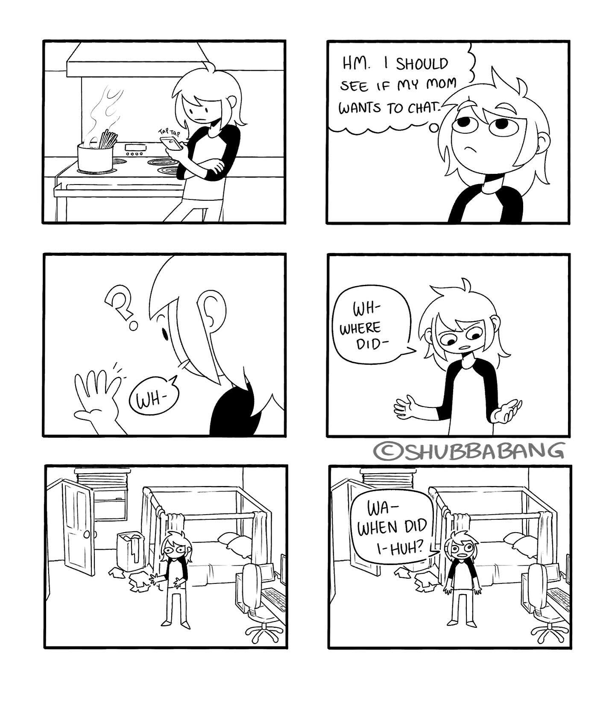

Jetzt mal abgesehen von dem typischen Zappelphilip den man sich glaube ich erst mal vorstellt, hier vielleicht ein paar Symptome die jedem AD(H)S-ler bestimmt bekannt sind, aber "das machen ja alle so.... oder?"

!!!tip
    Auch sehr schön: [ADxS.org - "Die häufigsten Irrtümer über ADHS"](https://www.adxs.org/de/page/16/die-haeufigsten-irrtuemer-ueber-adhs)

# Hab Ich Vergessen

Mein Liebling. Also sagen man hätte vergessen die Mail abzuschicken obwohl dieser zwei Minuten Task die letzten zwei Wochen im zweistelligen Bereich Mal täglich wieder im Kopf rumgeflogen ist, aber es irgendwie nicht der richtige Zeitpunkt war oder halt einfach nicht ging. Aber erklär das mal jemandem. Nein. Dann lieber sagen man hätte es vergessen.

# Demenz

Genau so wie man sagt, man hätte etwas vergessen, es aber eigentlich nicht vergessen hat, gibt es bei ADHS auch die Momente in denen man an seiner eigenen Zurechnungsfähigkeit zweifelt.
Aber keine Sorge. Ist keine Demenz. Du kannst nicht vergessen, was du dir nie gemerkt hast.

Jeder kennt bestimmt den Moment in dem man in die Küche geht und nicht weiß warum man dort ist. Dann muss man wieder in sein Zimmer zurück um sich zu erinnern, dass man ein Glas Wasser holen wollte.
Das ist ok. Das ist menschlich. Das ist normal.
Fünfzig Mal am Tag so eine Situation ist vielleicht nicht mehr normal.

Ohne Medikamente habe ich mich so oft am Tag in Situationen gefunden und nicht gewusst wie ich da hingekommen bin. Ich sitze dir plötzlich gegenüber, höre mich reden, und darf aus dem, was ich mich gerade noch zu Ende sagen höre, extrapolieren warum ich das wahrscheinlich gerade erzähle. Aber eine echte Übergabe von Vergangenheits-ich vom Beginn des Satzes gibt es nicht.
Ein Hauptgrund für mich mir wieder Medikamente zu besorgen war es, dass ich mich gerne wieder an den Anfang meiner eigenen Sätze erinnern wollte.

Dieser Moment, wenn man in seinem Zimmer steht, "plötzlich" eine Schraubzwinge in der Hand hat und sich fragt was man denn damit machen wollte weil man vergessen hat, dass man gerade aufräumt und die deswegen weg räumt, sich dann aber überlegt "Ach ja, ich wollte bestimmt gerade mein Fahrrad reparieren".

Oder man hat mal wieder auf einem Weg von zwei Metern sein Glas Wasser "verloren" und sucht erst mal fünf Minuten bis man es wieder findet neben dem Kalender den man kurz im vorbeigehen auf den richtigen Monat geblättert hat und das Glas dafür nur ganz kurz hinter der Pflanze abgestellt hat.
Seufz.
Ich hab mir irgendwann aus Frust 50 Bleistifte gekauft weil ich den bei Holzarbeiten eh nach nur einer Markierung am Holz verloren habe und mir einen neuen holen muss bis ich wieder alles aufgeräumt habe.

Das alles ist aber nicht unbedingt Demenz. Da wird nichts aus deinem Speicher gelöscht. Das gelangt gar nicht erst ins Langzeitgedächtnis. Das geht direkt auf dem Weg dahin verloren.

# Exekutive Dysfunktion

Hier leicht überspitzt als Comic dargestellt, aber sehr schön und treffend.

Dazu gehört auch folgendes:

# Geräuschempfindlichkeit

Anekdotische Evidenz aber es scheint so zwei Arten von ADHS-ler zu geben. Entweder die ganze Zeit volle Stille und am besten selbst zu Hause mit Ohropax oder immer und überall Stimulanz. Alles was ablenken könnte die ganze Zeit mit anderen Geräuschquellen überdecken.

# Jack Of All Trades

Bist du wirklich ein "Jack of all trades", oder hast du einfach nur ADHS und lernst zwanghaft neue Dinge, bis du gut darin bist um direkt zum nächsten überzugehen?
Frag ja nur.
Btw: -> [What is a Wildcard Person?](https://wildcardpeople.com/what-is-a-wildcard-person)

# Emotionale Volatilität

> Emotionale Volatilität bedeutet, dass Gefühle bei Betroffenen schnell, intensiv und oft unverhältnismäßig stark wechseln, was die emotionale Kontrolle erschwert.

Dieses neue Hobby was du seit gestern hast. Was dich bis in den Hyperfocus hinein fasziniert und weshalb du dich schon in 10 Jahren als weltbekannter Vorreiter darin siehst? Ja. Ja genau.
Und als dir jemand letztens konstruktive Kritik gegeben hat. Bist du da direkt in Abwehrhaltung gegangen und hattest Schwierigkeiten nicht emotional darauf zu reagieren?
Und wie fühlt sich das an wenn du deine Schuhe nicht findest wenn du los gehen möchtest und eh schon viel zu spät dran bist? Bist du dann ein Versager und die Welt ein Haufen Scherben?

Es mag fast langweilig klingen, aber für neurotypische Menschen gibt es (meistens) einen Moment zwischen Wahrnehmung und Empfindung. Ein Moment in dem sie entscheiden können, wie sie auf eine Situation reagieren. Bei Menschen mit ADHS ist dieser Moment oft sehr kurz oder gar nicht vorhanden. Das bedeutet, dass sie oft direkt auf eine Situation reagieren, ohne sich bewusst zu sein, dass sie auch anders reagieren könnten.

Auch hier ist wieder das Beispiel aus "Aber das machen doch alle so, oder?" nützlich. Jeder muss mal schlafen. Nicht jeder hat Narkolepsie. Jeder hat mal schlechte Laune. Nicht jeder ist emotional volatil.

# Erhöhter Gerechtigkeitssinn

Ein "Symptom", welches oft für ADHS und Autismus aufgeführt wird, und ich nie so richtig verstanden habe. Bis ich folgende Beschreibung gefunden habe:

Wenn Neurodivergente eine Regel nicht verstehen, werden sie diese nie befolgen. Sie werden diese höflichst ignorieren, da sie diese als Nonsens empfinden so lange wie sie nicht verstehen warum diese Regel existiert.
Wenn sie diese Regel aber verstehen, dann können die schon mal sehr wütend darüber werden, wenn jemand anderes diese klare und sinnvolle Regel nicht befolgt.
Und nichts dazwischen.

# Nicht Alles Ist ADHS

Wenn man anfängt, sich mit ADHS auseinanderzusetzen, dann kommt man schnell in den Modus, alles an sich und anderen als Eigenschaft von ADHS zu beschreiben.
Ich persönlich habe mit von ~10 bis ~16 Medikamente genommen und später wieder mit Ende 20 angefangen.
Ich habe auch inzwischen einige Menschen in ihrem Weg der medikamentösen Einstellung erlebt.
Ich behaupte recht viel Erfahrung damit zu haben was ADHS ist und was nicht. Hauptsächlich natürlich an mir selber, aber auch durch Erlebnisse mit anderen.
An mir selber merke ich ganz genau die Momente in denen ich etwas tue und mir denke.... "Oh, das war eine pure ADHS Handlung... Ja, ich hab meine Medis nicht genommen. Na gut. Jetzt ist auch zu spät."
Und genau so kann ich mich fragen "Stresst mich das gerade wegen ADHS, oder ist das einfach echt stressig?"
Oder mit Freunden das gleiche wenn ich die fragen kann "Na? Keine Medis genommen?" "Hm? Ähm. Ne. Verdammt. Hast Recht."
Und es sind ganz kleine Feinheiten teilweise. Bisschen ungeduldiger beim reparieren von etwas. Eine unbedachte Bewegung der Hand, die dem anderen wahrscheinlich nicht mal auffällt. Die Art einen Satz zu strukturieren. Die kleinen Dinge eben.

Aber nicht alles ist ADHS. Menschen können auch einfach so bestimmte Charakterzüge und Interessen haben. Und nur weil man sich dank ADHS Hyperfokus irgendwann mal in ein Thema reingebohrt hat, heißt das nicht, dass jedes weitere Mal wo man sich mit diesem Hobby beschäftigt, dass automatisch ADHS oder Hyperfokus ist. Hobbies dürfen merkwürdig sein.
