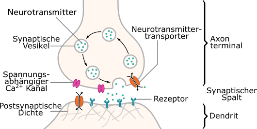
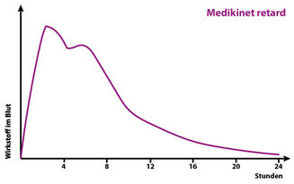
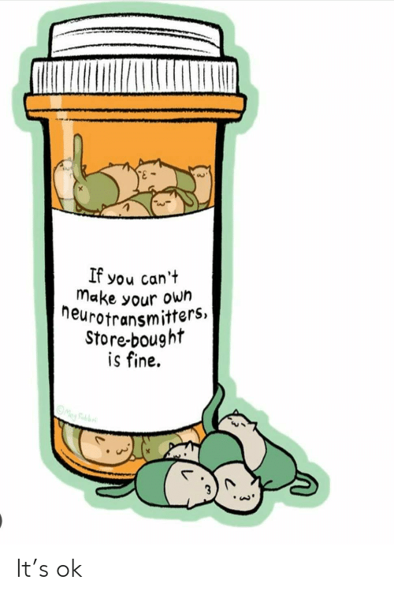

# Was Gibt Es Für Medikamente?

Es gibt noch mehr als diese. Es gibt auch Medikamente die beispielsweise speziell bei einer zusätzlichen Diagnose von Depression verschrieben werden. Aber die folgenden scheinen so die gängigsten zu sein.

!!!tip "Siehe auch"
    - https://www.adxs.org/de/page/182/geeignete-medikamente-bei-adhs
    - https://www.adxs.org/de/page/483/stimulanzien-mph-amp-bei-adhs

## Methylphenidat

!!!quote
    Methylphenidat hemmt die Wiederaufnahme der Neurotransmitter Dopamin und Noradrenalin, indem es deren Transporter in ihrer Funktion blockiert. Diese Transporter sitzen in der Zellmembran der präsynaptischen Nervenzellen und dienen einer schnellen Wiederaufnahme der Neurotransmitter aus dem synaptischen Spalt. Infolge der Wiederaufnahmehemmung (Reuptake-Inhibition) erhöht sich die Konzentration der Botenstoffe und ihre Wirkung hält länger an.

    Dies führt zu erhöhtem Signalaufkommen am Rezeptor und unter anderem zu einer Erhöhung des Sympathikotonus. In geringem Maße sorgt Methylphenidat für die Freisetzung von Katecholaminen, aber in erster Linie wird die Erhöhung der Dopaminkonzentration durch Wiederaufnahmehemmung erreicht.
*Quelle: https://de.wikipedia.org/wiki/Methylphenidat#Wirkungsweise*

In einfach:
Wenn deine Synapse 10 Dopamin braucht um eingeschaltet zu werden, aber schon nach 5 Dopamin wieder aufgeräumt wird, ist das doof. Deswegen wird der Aufräumer ein wenig verlangsamt und Gedanken können besser fließen.

Warum wird das Dopamin überhaupt aufgeräumt?
Damit die Synapse wieder aktiviert werden kann. Stell dir das vor wie einen Muskel. Wenn sich ein Muskel nicht wieder entspannt, ist das ein Krampf. Genau so muss auch eine Synapse wieder frei gemacht werden.
Alle Rezeptoren werden mit der Zeit freigeräumt.
Nikotin dockt auch an Rezeptoren an. Die Welt wäre wahrscheinlich eine andere, wenn der Rezeptor ab da dauerhaft aktiviert wäre.

### Medikinet (nicht retardiert):

**Wirkstoff:** Methylphenidat
**Freisetzung:** Sofortige Freisetzung
**Wirkungsdauer:** Ca. 3-4 Stunden
**Typ:** Dopamin-Wiederaufnahmehemmer
**Verabreichung:** Mehrmals täglich, um eine kontinuierliche Wirkung zu gewährleisten

### Medikinet Retard Adult

**Wirkstoff:** Methylphenidat
**Freisetzung:** Zweiphasige Freisetzung (schnelle initiale Freisetzung von 50% des Wirkstoffes gefolgt von einer zweiten Freisetzung nach etwa 4 Stunden)
**Wirkungsdauer:** Ca. 6-8 Stunden
**Typ:** Dopamin-Wiederaufnahmehemmer
**Verabreichung:** Einmal täglich
**Besonderheiten:** Medikinet Retard Adult hat eine zweiphasige Freisetzung, die eine schnelle Anfangswirkung und eine zweite Freisetzung nach etwa 3-4 Stunden bietet. Dies kann zu einem zweiten Wirkungsgipfel führen, was für manche Patienten vorteilhaft sein kann.

!!!quote
    Bei Medikinet retard wirkt das Präparat kurz nach der Einnahme am stärksten. Wenn es nach ca. zwei bis drei Stunden seinen Wirkungshöhepunkt erreicht hat, lässt der Effekt etwas nach. Etwa eine Stunde später steigt der Pegel noch einmal etwas an, um dann langsam gegen Null auszulaufen.
*Quelle: https://www.adhs-selbsthilfe-muenchen.de/themen/wirkungsweise-medis/*

### Kinecten

**Wirkstoff:** Methylphenidat
**Freisetzung:** Modifizierte Freisetzung (spezielle Technologie, die eine gleichmäßigere und längere Freisetzung über den Tag ermöglicht)
**Wirkungsdauer:** Ca. 8-12 Stunden
**Verabreichung:** Einmal täglich
**Besonderheiten:** Kinecten nutzt eine spezielle Freisetzungstechnologie, die eine längere und gleichmäßigere Wirkungsdauer ermöglicht. Dies kann dazu beitragen, Schwankungen in der Wirkung zu minimieren und eine stabilere Symptomkontrolle über den Tag hinweg zu gewährleisten.

Kinecten ist ein neues Methylphenidat-Präparat, das in Deutschland seit Ende Dezember 2022 für Erwachsene verfügbar ist.

## Lisdexamfetamin

### Elvanse Adult

**Wirkstoff**: Lisdexamfetamin
**Typ**: Prodrug von Dextroamphetamin
**Wirkdauer**: ca. 10 bis 12 Stunden

Lisdexamfetamin (LDX) ist eine synthetisch hergestellte Prodrug aus der Stoffgruppe der Amphetamine. Es wird im Körper zu Dextroamphetamin umgewandelt, das seine Wirkung entfaltet.

!!!quote
    Der Mechanismus der therapeutischen Wirkung von Amphetaminen bei ADHS ist nicht vollständig geklärt. Vermutlich beruht er auf einer vermehrten Freisetzung von Noradrenalin und Dopamin in den synaptischen Spalt. Diese Ausschüttung wird vor allem durch eine Umkehr der Arbeitsrichtung der Dopamintransporter (DAT) bewirkt. Im Gegensatz zum Prinzip der Wiederaufnahmehemmung (wie etwa bei Methylphenidat) wird dabei der Transmitterspiegel unabhängig von der Aktivität der Nervenzelle erhöht.

*Quelle: https://de.wikipedia.org/wiki/Lisdexamfetamin#Wirkungsmechanismus*

Anders als Medikinet kann Elvanse unabhängig von der Nahrungsaufnahme eingenommen werden. Nach fettreicher Mahlzeit kann der Spitzenplasmaspiegel um etwa eine Stunde verzögert sein.

#### Dosierung Und Schlafstörungen

Elvanse ist so lange im Körper wirksam, bis es verstoffwechselt ist. Der Mechanismus ist also ähnlich wie bei Alkohol.
Der Nachteil ist, dass es in höheren Dosierungen öfter zu Schlafstörungen kommt. Das liegt daran, dass durch die Aufnahme im Blut, die Höhe der Dosis über die Dauer der Wirksamkeit entscheidet. Je höher die Dosis, desto länger die Wirkung.

# Warum Gibt Es Erst Medikinet/Kinecten Und Dann Elvanse?

Typischerweise scheint man in Deutschland erst mal Medikinet oder Kinecten verschrieben zu bekommen. Und wenn man dann irgendwann beim Doc sagt, dass das ja schon hilft, aber irgendwie ist nicht so richtig konstant und irgendwie müsste das doch besser gehen. Dann wird einem (typischerweise) ein Amphetamin wie Elvanse verschrieben. Und plötzlich kann man nicht nur durch den Nebel im Hirn durchschauen, nein, er ist einfach weg. Und man fragt sich, warum nicht gleich?
Meine Vermutung? Geringeres Missbrauchspotential. Wenn es schon so schwer ist medizinisches Gras zu verkaufen, dann muss man nicht direkt jemandem Speed in die Hand drücken weil die Person von Konzentrationsproblemen berichtet. Ich überspitze ein wenig, aber im Grunde finde ich es ganz ok, dass nicht direkt die Keule rausgeholt wird, sondern erst Mal geschaut wird, was es denn noch für softere Medikamente gibt. Und für viele reichen Ritalin oder Medikinet bestimmt auch. Für andere halt nicht.

# Alternative Mikronährstoffe

Für Leute die sich nicht an Medizin herantrauen weil sie vielleicht Probleme mit der Pharmaindustrie haben oder allgemein keine Medikamente nehmen möchten, wollen sich vielleicht über Nährstoffe informieren und stattdessen auf Amazon Nahrungsergänzungsmittel als Pulver kaufen um es in ihren shake zu mischen.
Es gibt jedoch keine ausreichenden wissenschaftlichen Beweise für die Wirksamkeit von alternativen Mikronährstoffen wie beispielsweise Phenylalanin und Tyrosin.

# Medikamente Alleine Sind Auch Nicht Die Lösung

Jemandem mit 40 das erste Mal eine Brille in die Hand zu drücken wenn man sein Leben lang schon eine Sehstärke von +7 hatte, und zu glauben das passt dann schon, klingt absurd. Hat die Person je richtig lesen lernen können? Konnte die Person einen Führerschein machen? War die Person in ihren sozialen Kontakten eingeschränkt, weil sie Gesichter schwer unterscheiden konnte und feine Nuancen der Mimik nicht erkennen konnte?
Genau so absurd wäre es aber auch auf Krampf einer sehbehinderten Person das Lesen beizubringen, ohne eine Brille anzubieten.

Eine Diagnose von ADHS im Erwachsenenalter ist ähnlich. Es gibt vieles an Fähigkeiten die endlich erlernt werden können. Gewohnheiten können endlich gebildet werden. Alte Traumata können aufgearbeitet werden und neue Verhaltensmuster können sich formen.
Das geht bestimmt auch alleine. Aber muss auch nicht. Hol dir Hilfe, sprich mit Freunden, nimm, wenn möglich, Therapie in Anspruch. Die meisten ADHS-ler haben was aufzuarbeiten. Keine Kapsel kann dein Kindheitstrauma auflösen. Aber sie kann dir helfen stabil genug zu sein um es gemeinsam mit professioneller Hilfe anzugehen.

Persönliche Meinung:
Hol dir die Kapseln die deine dysregulierten Neurotransmitter wieder einrenken, halte dich fit und gesund und lass dich therapieren. Das ergänzt sich gegenseitig.

# Angst Vor Medikamenten

## Was Ist Wenn Ich Abhängig Werde?

Aus eigener Erfahrung kann ich sagen... Ne. Und nicht nur aus meiner Erfahrung. Ich kenne niemanden, der eines der Medikamente nimmt und nicht irgendein System nutzt um sich daran zu erinnern die Medikamente zu nehmen weil man sie sonst vergisst.

Kleine Anekdote:
Ich hatte mal den schönen Moment wo einfach wieder alles schief lief. Das Leben glitt mal wieder einfach wie Sand durch die Hände. Ich war völlig im Stress. Wie kann das nur sein? Nichts krieg ich mehr auf die Reihe. Nicht mal das neue Rezept für die Medikamente hab ich bestellt. Jetzt hab ich seit einer über einer Woche schon keine....... keine..... keine Medikamente mehr. Ich hab seit über einer Woche keine Medikamente mehr. Ah. Plötzlich macht alles Sinn.

PS: Ich kann die App "MyTherapy" empfehlen. Ist genau dafür. Mit einstellbaren Erinnerungen alle X Stunden, Möglichkeit zu snoozen und Meldungen wenn man nur noch eine voreingestellte Zahl an Kapseln hat. Bestes Tool.

## Und Die Nebenwirkungen?

Man hat weniger Appetit. Bei Medikinet merklich weniger, bei Elvanse ist es fast nicht zu merken. Es nicht so als ob man weniger Essen mag. Wenn die Kollegen Mittag essen, freut man sich genau wie jeder andere übers Essen. Aber man hätte es vielleicht nicht selber vorgeschlagen. So auf dem Level. Ich hoffe das ergibt Sinn

## Und Die Langzeitfolgen?

Es gibt bekannte mögliche Langzeitnebenwirkungen. Bei langfristiger Zunahme der Medikamente wird beispielsweise geraten vorher ein EKG machen zu lassen da eine potentielle, Langzeitfolge ein leicht erhöhter Blutdruck sein kann. Bei den meisten Menschen nicht bedenklich, aber Menschen mit Vorgeschichte achten sollten vielleicht ab einem bestimmten Alter bei ihrem jährlichen Gesundheits-Check drauf hinweisen. Es ist nicht zwingend erforderlich, aber lieber ein bisschen zu vorsichtig. Da es ein wichtiges Thema ist, zitiere ich hier eine lange Antwort auf die Frage:
"**Was sind die Langzeitfolgen von Ritalin?**"

!!!quote "Kerstin Konrad, Professorin für Klinische Neuropsychologie des Kindes– und Jugendalters der RWTH Aachen"
    Das ist ein relativ komplexes Thema und beschäftigt die Wissenschaft gerade sehr. Denn es gibt bislang in diesem Bereich noch relativ wenig belastbare Daten und teilweise sind Studienergebnisse widersprüchlich. Schwierig wird es schon bei der Frage, was mit „Langzeit“überhaupt gemeint ist. In Übereinstimmung mit einer vorgeschlagenen Definition der Europäischen Kommission beziehen sich meine Aussagen zu „Langzeitfolgen“auf eine Behandlung von mehr als einem Jahr.

    Das unter dem Handelsnamen Ritalin bekannte Methylphenidat gehört zu den Stimulanzien, also zu Medikamenten mit stimulierender Wirkung. 2009 kam ein Komitee der Europäischen Kommission zu dem Schluss, dass Stimulanzien im Allgemeinen und Methylphenidat im Besonderen insgesamt vermutlich sicher sind: Sie haben also eine gute Wirksamkeit, und schwerwiegende Nebenwirkungen sind sehr selten. Das Komitee forderte aber noch mehr Langzeitdaten.

    Ein internationales Forschungskonsortium der Europäischen Union (ADDUCE), an dem auch ich beteiligt bin, untersucht daher gerade die Langzeitauswirkungen von Methylphenidat auf Wachstum, Pubertätsentwicklung und auf das Herz-​Kreislauf-​System. Außerdem schauen wir uns neurologische, kognitive und psychiatrische Nebenwirkungen an. Was weiß man nun bislang über etwaige Langzeitfolgen?

    Blutdruck: Bereits bekannt ist, dass Methylphenidat ein klein wenig den Blutdruck erhöht und die Herzrate um ungefähr zwei Schläge pro Minute beschleunigt. Das klingt zunächst einmal nicht viel und scheint auf den ersten Blick unproblematisch. Allerdings wissen wir noch nicht, ob dies Langzeitfolgen hat, gerade bei denjenigen, die etwa mit Bluthochdruck vorbelastet sind. Eine Folge könnte ein behandlungsbedürftiger Bluthochdruck sein.

    Schlafstörungen: Schlafstörungen liegen bei aufputschenden Stimulanzien wie Methylphenidat auf der Hand. Dabei haben Betroffene mit ADHS sowieso schon mit Schlafproblemen zu kämpfen. Es gibt aber sowohl Befunde, denen zufolge sich der Schlaf bei Betroffenen durch die Medikation langfristig verbessert, als auch Befunde, dass er sich verschlechtert.

    Drogenmissbrauch: Ein in der Öffentlichkeit viel diskutiertes Thema ist, ob die medikamentöse Behandlung von ADHS das Risiko eines Substanzmittelmissbrauchs erhöht. Nach der jetzigen Datenlage würde ich aber eher sagen, dass Methylphenidat hier keinen Einfluss hat.

    Wachstum: Eine große amerikanische Studie legte zunächst nahe, dass Stimulanzien wie Methylphenidat das Wachstum von Kindern bremsen. Möglicherweise weil diese Stoffe häufig einen Appetitmangel verursachen, die Kinder in der Folge weniger essen und daher das Wachstum gebremst wird. Mittlerweile scheint es aber, dass das reduzierte Wachstum bis zum Erwachsenenalter wieder ausgeglichen werden kann. Vor allem bei Vorschulkindern muss man hier dennoch das Wachstum kontrollieren und eventuell die Behandlung mit Medikamenten vorübergehend aussetzen.

    Gehirn: Was die Langzeitveränderungen im Gehirn angeht, gibt es fast keine Daten aus Studien mit Menschen, sondern nur von Tierversuchen. Offenbar führen aber Stimulanzien wie Methylphenidat eher zu einer Normalisierung sowohl von Hirnaktivierungen als auch der Hirnstruktur. Manche Patienten berichten auch von persönlichkeitsverändernden Auswirkungen: Wenn sie das Medikament nicht nehmen, hätten sie gar keinen Antrieb, keine Motivation mehr. Das wirft natürlich die Frage auf, ob man durch die pharmakologische Behandlung das Belohnungs– und Antriebssystem des Menschen langfristig verändert. Das trifft aber offensichtlich eher auf Einzelfälle zu. Allerdings muss man solche Patienten natürlich im Auge behalten.

## Big Pharma

Ja, Big Pharma will Geld von mir und ich will wissen warum ich gerade aufgestanden bin und was ich wollte und warum ich mir meine Schuhe angezogen habe. Wenn ich das Problem durch Medikamente lindern kann und Big Pharma dafür Geld von meiner Krankenkasse bekommt, dann ist das halt so.

# Was Kann Ich Bei Der Einnahme Beachten?

## Essen

Die typische mögliche Nebenwirkung der meisten Medikamente hier ist vermindertes Hungergefühl. Da der typische ADHS-ler eh nicht so gut in der regelmäßigen Nahrungsaufnahme ist, ist das normalerweise keine große Veränderung. Und nur weil man vielleicht weniger Hunger hat, hat man dennoch Appetit.

Also sei dir dem bewusst und gehe damit auf deine Weise um. Vielleicht hast du eine App die dich zwischendurch fragt ob du Hunger hast? Vielleicht gewöhnst du dir nun an zu frühstücken?

## Uhrzeiten

Bei einem länger wirkenden Medikament auf gar keinen Fall zu spät nehmen. Je früher, desto besser und auf gar keinen Fall zu spät.

Auch wenn ich persönlich Elvanse nicht "merke", so merke ich schon, wenn ich das Medikament zu spät genommen habe. Ich bin auch ohne Medikamente eine Nachteule, aber auch ich habe irgendwann feststellen müssen, dass ins Bett gehen nicht so richtig was bringt, wenn ich die Kapsel erst nach 12 genommen habe.

Eine Freundin stellt sich gerne einen Wecker eine halbe Stunde bevor sie aufstehen muss, nimmt die Kapsel, und legt sich wieder hin. Nach 20 30 Minuten wacht sie dann ganz "natürlich" und entspannt auf. Geht natürlich nur mit so etwas wie Elvanse, was nicht während/nach dem Essen genommen werden muss.

## Hormone

Insbesondere bei Frauen kann es durch die Periode zu Schwankungen in der Wirkung kommen. Das ist nicht ungewöhnlich und kann auch bei anderen Medikamenten vorkommen. Ich bin selbst nicht betroffen, aber ich habe sogar bereits von einer Freundin mitbekommen, dass sie teils gefühlt gar keine Wirkung mehr hatte. Das ist natürlich nicht so toll. Aber auch hier gilt: Mit dem Arzt sprechen.

# Die Apotheke Bekommt Die Medikamente Nicht

Es kann ab und an sein, dass Apotheken nichts da haben. Üblicherweise ist das aber in wenigen Stunden lieferbar.
Dennoch kann es ja mal dazu kommen, dass die Apotheke einem meldet, dass es derzeit nichts zu holen gibt und auch nichts lieferbar ist.
Grossist, bzw. der Großhändler hat möglicherweise nichts. Die Apotheke kann aber auch direkt beim Hersteller bestellen. Deswegen immer rechtzeitig mit ein paar Tagen Puffer ein neues Rezept bestellen.

# Kostenbeispiel

!!!info
    Die Kostenaufstellung ist exemplarisch.
    Ich kenne nicht die Kosten von jedem Neurologen. Aber ich denke es hilft um ein Gefühl zu bekommen.

Die Kapazitäten an Kassenpatienten sind fast dauerhaft ausgeschöpft. Man kann jedoch auch als Privatpatient oder gar Selbstzahler schnell Termine bekommen.

Kosten für Selbstzahler sind wie folgt:

- Rezept ausstellen: 3,80€
- Termin: 67,04€

Die Medikamente können auch als Termin-Selbstzahler über Kasse abgerechnet werden. Falls man dies jedoch aus irgendwelchen Gründen auch die Medikamente lieber selbst zahlen möchte, kostet das bisschen was extra:

- Medikinet 10mg 75 Kapseln: ~40€
- Elvanse 50mg 30 Kapseln: ~80€

Sobald man im System ist, die Anamnese/Diagnose vorliegt und man von den Medikamenten her eingestellt ist, kann man auch wieder normal auf Kasse abrechnen lassen. Das wird von einigen sogar empfohlen.
