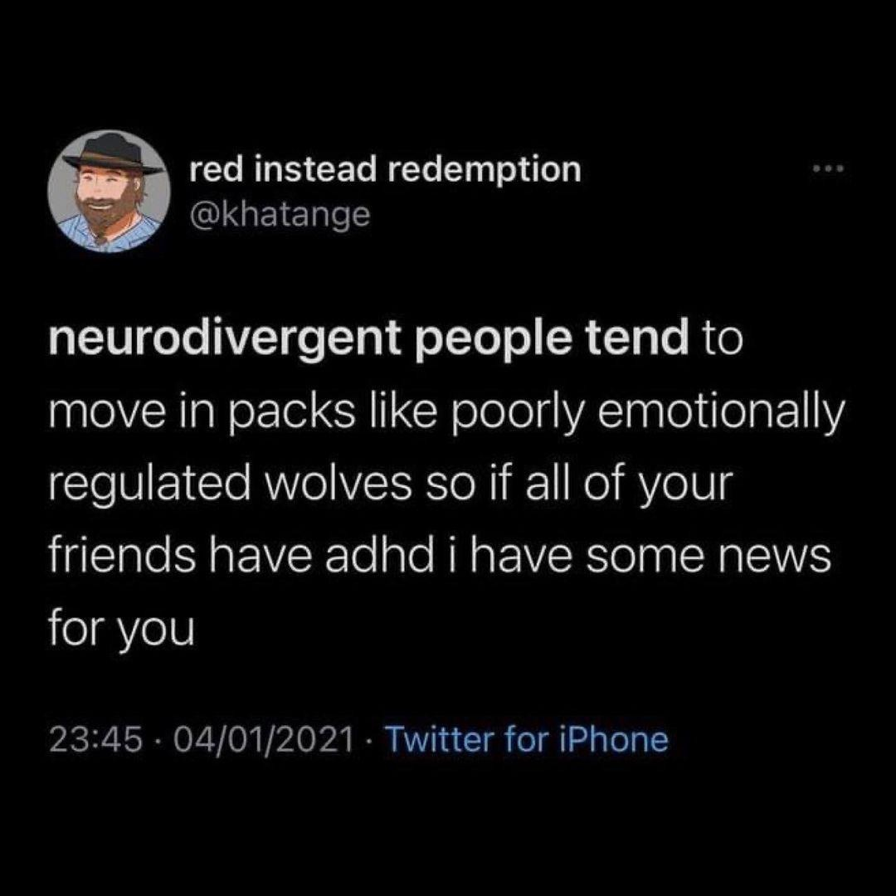

# Sorgen Und Ängste Sich Diagnostizieren Zu Lassen

## Ich Will Mich Nicht Ruhig Stellen Lassen. Meine Persönlichkeit Ist Keine Krankheit

Dopamin-Wiederaufnahmehemmer werden auch verwendet um Narkolepsie zu behandeln, da sie ein Stimulant sind. Amphetamine werden in der Drogenszene gerne als Speed verkauft. Wenn dich Stimulanzien und Speed beruhigen, entspannen, und konzentrierter machen, dann ist da vielleicht echt einfach was anders verkabelt bei dir, oder? Normalerweise gibt man kleinen Kindern ja auch nicht eine Cola zum einschlafen.

## Aber Das Machen Doch Alle So, Oder?

Alle Menschen müssen irgendwann mal schlafen. Manche machen sogar gerne ein zwei Nickerchen zwischendurch. Leute die aber kaum eine Stunde durchhalten ohne einzuschlafen, haben aber vielleicht ein paar Probleme am Leben wie ihre Mitmenschen teilzunehmen.
Und ja, ADHS ist genetisch und vererbbar. Nur weil dir deine Eltern sagen "Ach das ist normal. Ich bin auch oft verträumt", muss das noch lange nicht "normal" sein.

## Aber Ich Hab Doch Ein System

Du hast das jetzt alles gelesen und denkst: „Nee, ich habe kein ADHS. Ich habe ein System!“. Ach, hast du das? Was ist dein System? Hast du vor jeder Veranstaltung 5 Benachrichtigungen auf deinem Telefon eingestellt? Legst du deine Schlüssel immer an denselben Ort, damit du sie nicht vergessen kannst? Packst du wichtige Aufgaben auf deine Tastatur, damit du sie erledigen musst, bevor du deinen Computer benutzen kannst? Legst du deine gewaschene Wäsche auf dein Bett, damit du sie zusammenlegen musst, bevor du schlafen gehen kannst? Schreibst du einfach alles auf, sobald es dir in den Sinn kommt? Hast du alles in deinem Kalender? Sogar die Termine anderer Leute?

Das ist kein System. Das ist eine Notlösung. Das ist ein Weg, um mit deinen Symptomen klarzukommen.

Und genau das ist der Punkt. Du kannst ADHS haben und ein System haben. Du kannst ADHS haben und erfolgreich sein. Du kannst ADHS haben und ein funktionierendes Mitglied der Gesellschaft sein. Aber das bedeutet nicht, dass du kein ADHS hast. Es bedeutet nur, dass du einen Weg gefunden hast, damit umzugehen. Und das ist großartig. Aber es bedeutet nicht, dass du kein ADHS hast.

Aber hast du vielleicht ein verrücktes Leben, das dich manchmal durcheinanderbringt? Hast du dir aus irgendeinem Grund mehr vorgenommen, als du in einem vernünftigen Zeitrahmen schaffen kannst? Hast du die Zeit falsch eingeschätzt, die du brauchst, um etwas zu tun? Hast du vergessen, dass du eigentlich noch deine Kleidung waschen, Lebensmittel einkaufen und manchmal auch essen musst? Hast du vergessen, dass du schlafen musst? Hast du vergessen, dass du dich entspannen musst? Hast du einfach auf deinen Kalender geschaut und gedacht: „Oh, dafür habe ich Zeit“, und ihn dann mit Dingen gefüllt, die zu tun sind?

Machst du das vielleicht sogar absichtlich, weil du den Druck brauchst, um die Dinge tatsächlich zu erledigen? Brauchst du den Adrenalinschub, den die Panik in letzter Minute auslöst, um die Dinge tatsächlich zu erledigen? Fühlst du dich am wohlsten, wenn du mit 10 Dingen auf einmal jonglieren musst?

Bist du dann vom produktivsten Tag deines Lebens dazu übergegangen, drei Tage lang nur noch im Bett zu liegen, nicht mehr aufstehen zu können, nichts mehr tun zu können, nicht einmal mehr daran denken zu können, etwas zu tun?

Ich beschreibe einige der Dinge auf ziemlich extreme Weise. Aber das ist es ja gerade. ADHS ist ein Spektrum. Man kann es in einer leichten oder in einer schweren Form haben. Und man kann es so haben, dass es das Leben nicht so stark beeinträchtigt. Das heißt aber nicht, dass man es nicht hat.
Jemand mit +7 Dioptrien kann ohne Brille eigentlich nicht lesen und wird nie ohne Brille das Haus verlassen. Jemand mit +0,5 Dioptrien kann bestimmt noch lesen, wird sich nach einem langen Tag am Bildschirm aber wahrscheinlich nicht mit einem Buch entspannen.
