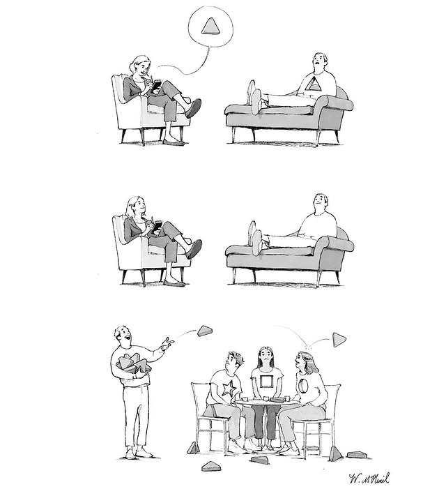
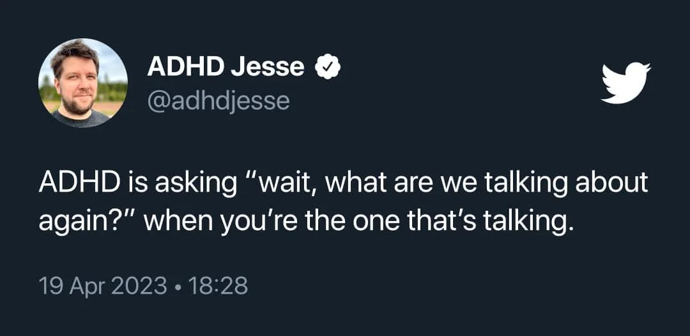
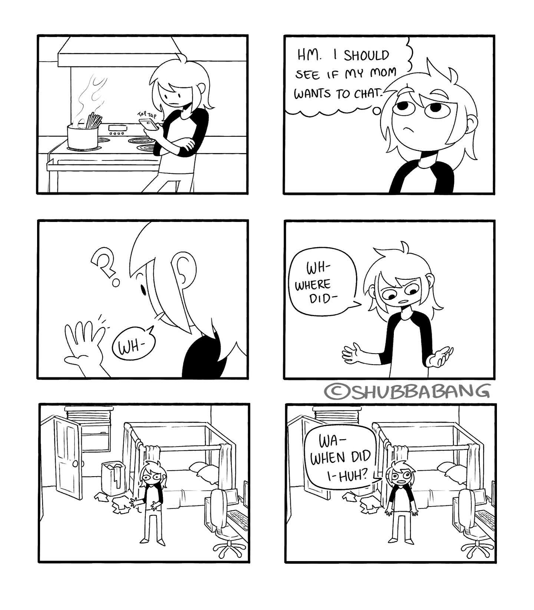
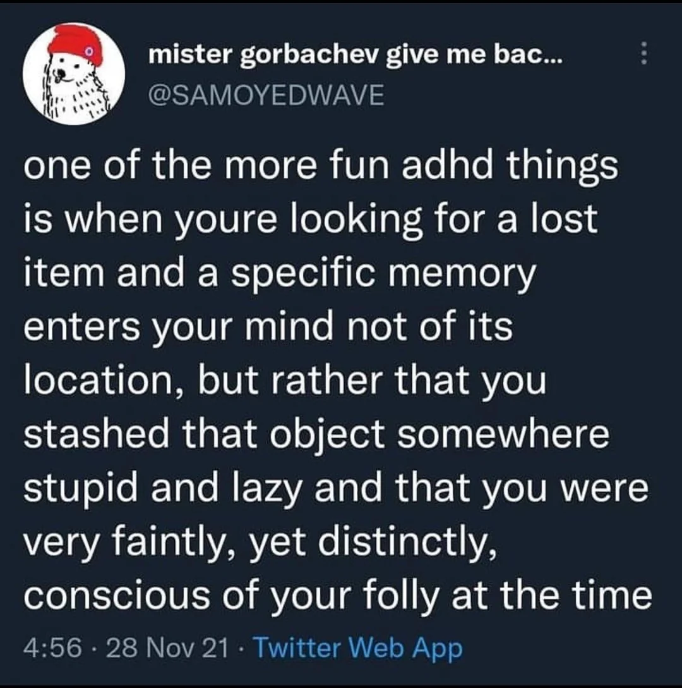
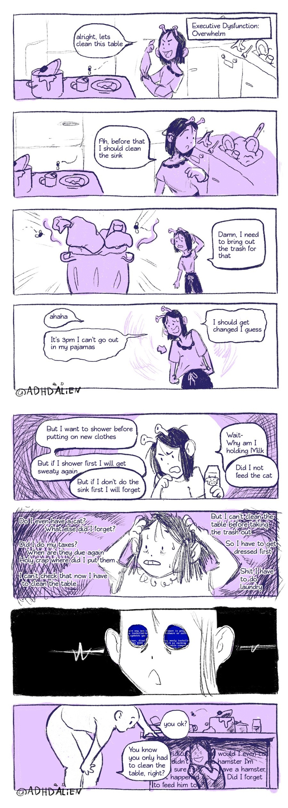

```toc
```

# Was Ist Das Für Eine Textwand?

Ich gehe offen mit meinem ADHS um, kenne meine dadurch entstandenen Schwächen und Stärken und schaffe es im Chaos meine Stabilität zu finden. Das war nicht immer so.
Meine Mutter hat lange versucht mich alternativ durch viele Sorten Therapie, Ernährungskonzepte und besondere Betreuung behandeln zu lassen weil sie mir keine Medikamente und auch das Stigma nicht zumuten wollte.
Ich will nicht sagen, dass mir das nichts gebracht hätte. Im Gegenteil. Ich profitiere noch heute davon. Aber das was es eigentlich lösen sollte, hat es nicht gelöst. Vielleicht gelindert.
Und dann kamen die Medis.
Weil ich für meinen Teil weiß wie viel Lebensqualität mir die Behandlung durch Medikamente gegeben hat und auch heute wieder gibt, bin ich immer wieder ein wenig traurig wenn mir Leute erzählen
> "Aber das ist doch auch überdiagnostiziert. Das hat doch jeder. Da muss man sich halt einfach mal am Riemen reißen. Man muss ja nicht gleich jeden mit Medikamenten ruhig stellen."

Ich sage nicht, dass Medis die einzige Lösung sind und alle die sich mit Yoga und Mikronährstoffen behandeln es falsch machen. ADHS ist ein riesiges Spektrum. Vielleicht reicht es ja schon. Vielleicht funktioniert es für jemanden. Doof nur wenn man sich vor den Möglichkeiten verschließt weil man meint das wäre alles böse und gefährlich.

Also schreib ich immer mal wieder an diesem Dokument weiter wenn mir mal wieder jemand eine Frage stellt oder Sorge mit mir teilt damit die Frage und meine Meinung, meine Erfahrungen und mein Halbwissen zu dem Thema auch anderen helfen.
Die Themen sind nicht wirklich nach Wichtigkeit oder Häufigkeit sortiert aber ich versuche sie so gut wie möglich zu gruppieren.


> [!info] Disclaimer
> Das Dokument ist nicht von einem Arzt oder einer Praxis herausgegeben und will auch gar nicht so tun als ob.
> Ich bin nur so'n Typ. Ich hab keine medizinische Ausbildung und ich schreibe aus dem Vorurteil heraus, dass die medizinische Behandlung Lebensqualität bringt und die Therapie die vorherigen vielen Traumata, die man ohne Behandlung erleiden musste, zu verarbeiten hilft.
> Meine Meinung, meine anekdotische Evidenz und meine mit meinem Vorurteil herausgesuchten Quellen ersetzen keine professionelle Beratung. Sie sind lediglich eine weitere Informationsquelle.
>
> Dies ist nur eine weitere Informationsquelle von einem Betroffenen für Betroffene, wie es bei einem lockeren Gespräch aufkommen könnte, in einer Sprache die einem ADHS-ler vielleicht auch sehr vertraut ist.
> Was für mich funktioniert, muss aber nicht für dich funktionieren. Du musst mir auch nicht zustimmen. Im Gegenteil. Schreib mir gerne wenn dir was auffällt oder mehr Fragen aufwirft.




# Was Ist ADHS Im Gehirn?

## Das Frontalhirn

Letztlich ist ADHS ein Problem im Frontalhirn (auch präfrontaler Kortex genannt).
Das Frontalhirn ist verantwortlich für:
- **Handlungsplanung**
- **Filtern**, indem es dabei hilft, relevante von irrelevanten Informationen zu unterscheiden
- **Impulse dämpfen**, wenn sie auftreten, und impulsives Verhalten hemmen
- **Aktuelle Erlebnisse abgleichen** mit denen in unserem Gedächtnis
- **Emotionen**
- **Entschiedungsfindung**

Dafür ist maßgeblich der Botenstoff Dopamin verantwortlich. Es gibt auch noch andere Neurotransmitter wie Noradrenalin und Serotonin, die ebenfalls wichtig für die Aufmerksamkeitsregulation und die Kontrolle von Impulsen sind. Aber üblicherweise ist es ein Problem in der Verfügbarkeit des Dopamins. Sei es durch weniger Rezeptoren oder durch weniger Dopamin im Allgemeinen. Mehr im Detail dazu aber später.

## Was Heißt Das?

Stark überspitzt und vereinfacht:
Einige Regionen in deinem Gehirn haben Schwierigkeiten mit der Dopaminverfügbarkeit.

Das ist nicht alles. ADHS umfasst ein komplexes Zusammenspiel verschiedener neurobiologischer Faktoren und es ist trotz intensiver Forschung noch nicht vollumfänglich verstanden. Es gibt regelmäßig neue Erkenntnisse und es ist beispielsweise noch nicht wirklich geklärt, wie genau es dazu kommt, dass das Erhöhen der Verfügbarkeit von Dopamin zu einer Milderung der Symptome führt.

Es hat sich beispielsweise auch herausgestellt, dass Nikotin die kognitive Funktion und Aufmerksamkeit verbessern kann und die Symptome lindert. Alkohol lindert ebenfalls durch Betäubung als Nervengift, aber Nikotin wirkt tatsächlich therapeutisch und es gibt Forschungen zu Medikamenten auf Nikotinbasis. Bisher scheint es jedoch noch nicht gelungen zu sein, ein Medikament auf Nikotinbasis herzustellen, das nicht abhängig macht. Was genau dabei passiert, wissen wir noch nicht.
Nikotin als Selbstmedikation ist daher ein nettes Fun Fact für alle die viel rauchen, es sollte jedoch nicht als Begründung genommen werden mit dem Rauchen anzufangen.

## Dopamin Und Noradrenalin

Quelle: https://adhs-erwachsene.net/biologische-grundlagen/
Die folgenden unterpunkte sind genau so von der genannten Seite kopiert weil ich sie echt gut fand.

### Dopamin

Dopamin steuert unsere Motivation, ist für die Bedeutungszuweisung – also das Erkennen von Zusammenhängen wichtig und ist Teil unseres Belohnungszentrums. Zuwenig Dopamin, heißt: Zusammenhänge werden nicht erkannt. Es liegt eine verminderte Motivation vor, Dinge zu beginnen (Aufschieberitis) und es stellt sich kein Zufriedenheitsgefühl ein. Deutlich zu viel Dopamin lässt uns Zusammenhänge erkennen, wo keine sind: Angela Merkel hat Falten am Hals, also ist sie in Wirklichkeit ein Echsenmensch. Bei zu viel Dopamin wird der Mensch wahnhaft und erleidet einen Realitätsverlust. Das nennt sich dann Psychose. Biologisch ist ADHS gewissermaßen das Gegenteil einer Psychose. Deswegen bekommen Patient:innen mit ADHS Medikamente, die den Dopaminspiegel erhöhen (meist Stimulanzien) und Psychotiker Medikamente, die den Dopaminspiegel senken (Neuroleptika).

### Noradrenalin

Ein zweiter Botenstoff der eine wichtige Rolle spielt, ist Noradrenalin. Noradrenalin ist nicht nur ein „Stresshormon“sondern spielt auch eine Rolle als Botenstoff, der den Abbau von Dopamin hemmt. Das bedeutet: Wenn ADHSler richtig Stress haben, können sie sich konzentrieren. Vorher nicht. Also benötigen Betroffene Stress, um sich ausgeglichen zu fühlen. Die spiegelt sich oft in stressiger Berufswahl: Rettungssanitäter, Manager, Pflegekräfte, Werbebranche, Gastronomie und Küche, Polizei, Streitkräfte und investigativer Journalismus.
Dies ist auch der Grund, warum so gut wie alle ADHSler schneller als der Durchschnitt auf Autobahnen unterwegs sind. Bei Tempo 80 ist die Konzentration nicht vorhanden**. Ab 160 km/h ist die Anspannung und die Notwendigkeit schnell reagieren zu können stark genug, um für eine gute Konzentration zu sorgen.

### Schlussfolgerung

Die Folge für die Lebensführung bei ADHS ist, dass Betroffene ihren Dopaminspiegel (und die damit einhergehende Fähigkeit sich zu konzentrieren oder Dinge zu beginnen) oftmals über eine Erhöhung des Noradrenalinspiegel stabilisieren. Einfach gesagt, benötigen ADHSler Stress, um sich ausgeglichen zu fühlen und sich zentrieren zu können.

Dies erklärt, warum ADHS Betroffene regelmäßig über ihre eigenen Belastungsgrenzen gehen und nicht aufhören können, einer Tätigkeit nachzugehen, bis absolute körperliche Erschöpfung einsetzt (Überarbeitung, exzessiver Sport oder das Anzetteln diverser Projekte, die parallel laufen). Dies führt-vor allem mit zunehmendem Lebensalter und dem Beginn körperlicher Einschränkungen-zu Erschöpfungszuständen und Depressionen. Sobald die depressive Symptomatik sich jedoch ein wenig stabilisiert, wird die Schleife von vorn los und die innere Ausgeglichenheit wird durch Selbstüberforderung erzeugt. Umgangssprachlich könnte man sagen, dass ADHSler so lange rennen, bis der Akku alle ist und sobald das Display wieder einen Balken Energie zeigt, erneut lossprinten. Bei Kompensation durch gute Bildung oder frühe Förderung gelingt es, Betroffenen dann häufig in einzelnen Gebieten überdurchschnittliche Leistungen zu erzielen. Grund dafür ist erneut eine hohe Dopaminausschüttung. Das Einarbeiten in einen neuen Bereich stimuliert bei intrinsischer Motivation das Belohnungszentrum. Die Folge ist ein häufiger Wechsel von Berufen oder Hobbys. Ab dem Moment, wo die Tätigkeit beherrscht wird, erzeugt sie Langeweile und es wird ein neues Aufgabenfeld gesucht. Dies erklärt zum Teil die von Betroffenen als quälend erlebte Frage nach eigenen Präferenzen und Lebenszielen.

### Also Was Ist ADHS?

Wenn man ADHS-Betroffenen L-Dopamin – also eine Vorstufe von Dopamin gibt, die man bei Parkinsonerkrankten einsetzt, ändert sich nichts, außer, dass den Betroffenen übel und schwindelig wird. Dennoch bewirkt eine Stimulation des Dopaminrezeptors über andere Substanzen eine deutliche Verbesserung der ADHS-Symptomatik.
Die korrekte Antwort auf die Frage was ADHS ist, müsste also lauten: **Keine Ahnung, aber man kann es einigermaßen gut therapieren.**

# Der Name

## ADHS Vs. ADS

Es wurde lange Zeit zwischen der hyperaktiven Variante (Zappelphilipp) und der eher abgelenkten/verträumten Variante unterschieden. Inzwischen wurde beides unter ADHS zusammengefasst und eher durch die ausgeschriebene Form unterschieden. Dabei gibt es die **hyper**aktive und die **hypo**aktive Varianten.
Von der Bezeichnung werden aber alle gleichermaßen unter ADHS zusammengefasst.

## Aufmerksamkeitsdefizit

Ein absolut irreführender Teil des Namens. Jeder, der sich mal über Tage und Wochen hinweg in einem Hyperfokus auf ein Thema wiedergefunden hat, hat definitiv keine Mangelerscheinungen was Aufmerksamkeit angeht.
Besser wäre Aufmerksamkeits*steuerungs*defizit. Denn wenn der Fokus die Unterschiede der Schnabelformen bei Wildgänsen ist, während man eigentlich was anderes machen sollte, dann steuert jemand die Aufmerksamkeit ohne Lenkrad.

## Neurodivergenz

Aufgrund der vielen Gemeinsamkeiten zwischen ADHS, Autismus und anderen Spektrumsstörungen ([[#^6e5d4f|Mehr dazu später]]) wird oft auch zwischen Neurotypischen und Neurodivergenten unterschieden. Es ist also nicht ungewöhnlich einen ADHS-ler von sich als neurodivergent zu sprechen und von den "den anderen" als neurotypisch. Auch wenn man damit nicht explizit ADHS meint.

# Diagnose - Rechtliches

Es ist für dich wahrscheinlich nicht wirklich nötig zu wissen was die Richtlinien sind. Aber vielleicht interessiert es dich? Oder du stellst dir die Frage, ob die Diagnose von einem Institut überhaupt rechtskonform ist?
Ich persönlich hätte jedenfalls nicht einfach so Ahnung gehabt was wie wo geregelt, empfohlen oder verlangt wird.

Außerdem hilft diese Auflistung hier um intern darauf verlinken zu können, wenn ich weiß, dass eine Anlaufstelle bestimmte Diagnostik bzw. Fragebögen verwendet. Das hilft möglicherweise auch.

## Wie Ist Die Diagnostik Geregelt?

Durch den G‑BA (Gemeinsamer Bundesausschuss).

Der G‑BA ist das höchste Beschlussgremium der gemeinsamen Selbstverwaltung im deutschen Gesundheitswesen. Er legt fest, welche Leistungen von der gesetzlichen Krankenversicherung (GKV) übernommen werden. Seine Richtlinien und Beschlüsse sind für alle Leistungserbringer (Ärzte, Psychotherapeuten, Krankenhäuser etc.) sowie für die Krankenkassen verbindlich – sprich, sie sind insbesondere im Rahmen der GKV für die Erstattung und Versorgung bindend.

Hier ist der bis heute geltende Beschluss vom März 2013

[Arzneimittel-Richtlinie/ Anlage III: Nummer 44 – Stimulantien](https://www.g-ba.de/beschluesse/1677/)

**Aus dem Beschlusstext:**

> ausgenommen bei Erwachsenen ab einem Alter von 18 Jahren mit Hyperkinetischer Störung bzw. Aufmerksamkeitsdefizit / Hyperaktivitätsstörung (ADS / ADHS), sofern die Erkrankung bereits im Kindesalter bestand, im Rahmen einer therapeutischen Gesamtstrategie, wenn sich andere Maßnahmen allein als unzureichend erwiesen haben. Die Diagnose erfolgt angelehnt an DSM-IV Kriterien oder Richtlinien in ICD-10 und basiert auf einer vollständigen Anamnese und Untersuchung des Patienten. Diese schließen ein strukturiertes Interview mit dem Patienten zur Erfassung der aktuellen Symptome, inkl. Selbstbeurteilungsskalen ein. Die retrospektive Erfassung des Vorbestehens einer ADHS im Kindesalter muss anhand eines validierten Instrumentes (Wender-Utha-Rating-Scale-Kurzform (WURS-k)) erfolgen. Die Arzneimittel dürfen nur von einem Spezialisten für Verhaltensstörungen bei Erwachsenen verordnet (Fachärztin/Facharzt für Nervenheilkunde, für Neurologie und / oder Psychiatrie oder für Psychiatrie und Psychotherapie, Fachärztin/Facharzt für psychosomatische Medizin und Psychotherapie, ärztliche Psychotherapeuten gemäß Bedarfsplanungs-Richtlinie) und unter dessen Aufsicht angewendet werden. In therapeutisch begründeten Fällen können bei fortgesetzter Behandlung in einer Übergangsphase bis maximal zur Vollendung des 21. Lebensjahres Verordnungen auch von Spezialisten für Verhaltensstörungen bei Kindern und Jugendlichen vorgenommen werden. In Ausnahmefällen dürfen auch Hausärztinnen/Hausärzte Folgeverordnungen vornehmen, wenn gewährleistet ist, dass die Aufsicht durch einen Spezialisten für Verhaltensstörungen erfolgt.

**Aus der zusammenfassenden Dokumentation:**

> Die Anwendung von Methylphenidat über längere Zeit (über 12 Monate) bei Patienten mit ADHS, erfordert zudem den langfristigen Nutzen des Arzneimittels für den Patienten regelmäßig neu zu bewerten, indem behandlungsfreie Zeitabschnitte eingelegt werden, um das Verhalten des Patienten ohne medikamentöse Behandlung zu beurteilen.
>
> Es wird empfohlen Methylphenidat mindestens einmal im Jahr abzusetzen, um das Befinden des Patienten zu beurteilen. Spezialisten für Verhaltensstörungen, die gleichzeitig die Berechtigung zur Verschreibung von Methylphenidat-haltigen Arzneimitteln haben, sind Fachärztin/Facharzt für Nervenheilkunde, für Neurologie und / oder Psychiatrie oder für Psychiatrie und Psychotherapie, Fachärztin/Facharzt für psychosomatische Medizin und Psychotherapie sowie ärztliche Psychotherapeutin/Psychotherapeut. Damit die Versorgung auch in ländlichen Regionen gesichert ist, dürfen in Ausnahmefällen auch Hausärzte Folgever-ordnungen vornehmen, wenn gewährleistet ist, dass die Aufsicht durch einen Spezialisten für Verhaltensstörungen aus den vorgenannten Berufsgruppen erfolgt.

[...]

> Zur retrospektiven Erfassung des Vorbestehens einer ADHS im Kindesalter ist derzeit nur die Wender-Utha-Rating-Scale-Kurzform (WURS-k) als validiertes Instrument anzusehen.

## Leitlinien Der Diagnostik

Die Diagnostik von ADHS in Deutschland basiert auf mehreren anerkannten Leitlinien und diagnostischen Kriterien. Die wichtigsten Richtlinien und diagnostischen Manuals sind:

### S3-Leitlinie ADHS Bei Kindern, Jugendlichen Und Erwachsenen

- **Herausgeber:**
	- Arbeitsgemeinschaft der Wissenschaftlichen Medizinischen Fachgesellschaften (AWMF)
- **Inhalte**:
	- Diese Leitlinie bietet umfassende Empfehlungen zur Diagnostik und Behandlung von ADHS. Sie basiert auf dem aktuellen Stand der wissenschaftlichen Forschung und wird regelmäßig aktualisiert.

### ICD-10 Und ICD-11

- **Herausgeber**:
	- Weltgesundheitsorganisation (WHO)
- **Inhalte**:
	- Das Internationale Klassifikationssystem der Krankheiten (ICD) bietet diagnostische Kriterien für ADHS. Die ICD-10 wird derzeit noch häufig verwendet, aber die ICD-11 wird zunehmend eingeführt.
- **Kriterien für ADHS**:
	- In der ICD-10 wird ADHS unter den Kategorien „Hyperkinetische Störungen“(F90) klassifiziert. Die ICD-11 bietet eine aktualisierte und detailliertere Beschreibung.

### DSM-5

- **Herausgeber**:
	- American Psychiatric Association (APA)
- **Inhalte**:
	- Das Diagnostische und Statistische Manual Psychischer Störungen (DSM-5) bietet detaillierte diagnostische Kriterien für ADHS. Es wird international verwendet und ist auch in Deutschland von Bedeutung.
- **Kriterien für ADHS**:
	- Das DSM-5 beschreibt ADHS als eine neuroentwicklungsbedingte Störung mit spezifischen Kriterien für Unaufmerksamkeit, Hyperaktivität und Impulsivität.

### National Institute For Health And Care Excellence (NICE) Guidelines

- **Herausgeber**:
	- NICE
- **Inhalte**:
	- Diese britischen Leitlinien bieten evidenzbasierte Empfehlungen zur Diagnose und Behandlung von ADHS und sind auch in Deutschland anerkannt.

### Deutsche Gesellschaft Für Kinder- Und Jugendpsychiatrie, Psychosomatik Und Psychotherapie (DGKJP)

- **Herausgeber**:
	- DGKJP
- **Inhalte**:
	- Die DGKJP gibt spezifische Empfehlungen und Leitlinien zur Diagnostik und Therapie von ADHS bei Kindern und Jugendlichen heraus.

Diese Leitlinien und Manuals stellen sicher, dass die Diagnostik von ADHS in Deutschland auf einem fundierten, wissenschaftlich basierten und standardisierten Prozess beruht. Sie bieten klare Kriterien und Vorgehensweisen, um eine zuverlässige und valide Diagnose zu stellen und die bestmögliche Behandlung zu gewährleisten.

## Wesentliche Bestandteile Einer Leitliniengerechten Diagnose

### Anamnese

#### Allgemeine Biographische Anamnese

- **Familienanamnese**: Untersuchung von ADHS, psychischen Störungen oder anderen relevanten Erkrankungen in der Familie.
- **Geburts- und Entwicklungsanamnese**: Informationen über Schwangerschaft, Geburt und frühkindliche Entwicklung.
- **Schulische und berufliche Anamnese**: Schul- und Berufslaufbahn, schulische Leistungen, Schwierigkeiten und Abbrüche.
- **Soziale Anamnese**: Soziale Beziehungen, Freundschaften, familiäres Umfeld.

#### Spezifische ADHS-Anamnese

- **Symptome**: Erfassung von Unaufmerksamkeit, Hyperaktivität und Impulsivität in verschiedenen Lebensbereichen (z.B. zu Hause, in der Schule, am Arbeitsplatz).
- **Beginn und Verlauf**: Alter bei Symptombeginn, Verlauf und Veränderungen über die Zeit.
- **Auswirkungen**: Auswirkungen der Symptome auf das tägliche Leben, soziale Interaktionen und Leistungsfähigkeit.

### Fremdanamnese

- **Berichte von Eltern, Lehrern und anderen Bezugspersonen**: Ergänzende Informationen zur Verhaltensbeobachtung in verschiedenen Kontexten.

### Strukturierte Interviews Und Fragebögen

- **Diagnostische Interviews**: Verwendung standardisierter Interviews wie dem „Diagnostic Interview for ADHD in Adults“(DIVA) oder dem „Kinder-DIPS“(Diagnostisches Interview bei psychischen Störungen im Kindes- und Jugendalter).
- **Fragebögen**: Einsatz von validierten Fragebögen wie dem „Conners‘Rating Scales“, „ADHD Rating Scale“oder dem „Strengths and Difficulties Questionnaire“(SDQ).

Siehe [[#Fragebögen, Interviewformate Und Sonstige Tests]]

### Verhaltensbeobachtung

- **Direkte Beobachtung**: Beobachtung des Verhaltens in verschiedenen Settings, z.B. in der Schule oder zu Hause.

### Psychometrische Tests

- **Intelligenztests**: Durchführung von Tests wie dem „Wechsler Intelligence Scale for Children“(WISC) oder dem „Wechsler Adult Intelligence Scale“(WAIS) zur Beurteilung kognitiver Fähigkeiten.
- **Leistungstests**: Tests zur Beurteilung der Aufmerksamkeit und Konzentration, z.B. der „Continuous Performance Test“(CPT) oder der „Test of Variables of Attention“(TOVA).

### Körperliche Untersuchung

- **Neurologische Untersuchung**: Ausschluss von neurologischen Erkrankungen, die ADHS-ähnliche Symptome verursachen könnten.
- **Allgemeine körperliche Untersuchung**: Überprüfung allgemeiner Gesundheit und körperlicher Entwicklung.

### Differentialdiagnostik

- **Ausschluss anderer Störungen**: Abgrenzung von anderen psychischen und neurologischen Störungen wie Angststörungen, Depressionen, Lernstörungen, Autismus-Spektrum-Störungen oder Schlafstörungen.

### Zusatzuntersuchungen

- **Laboruntersuchungen**: Bei Verdacht auf körperliche Ursachen oder Begleiterkrankungen.
- **Bildgebende Verfahren**: In seltenen Fällen zur Abklärung neurologischer Auffälligkeiten.

### Zusammenfassung Der Ergebnisse

- **Multidisziplinäre Fallbesprechung**: Zusammenführung aller Informationen und Besprechung im Team.
- **Diagnosestellung**: Basierend auf den DSM-5- oder ICD-10/11-Kriterien für ADHS.

## Fragebögen, Interviewformate Und Sonstige Tests

Es gibt einige standardisierte Fragebögen, die bei der Diagnose von ADHS eingesetzt werden können. Diese Fragebögen erfassen die Symptome, Verhaltensweisen und Auswirkungen der Störung in verschiedenen Lebensbereichen. Hier sind einige der häufig verwendeten Fragebögen:

Oft werden ASRS und IDA-R gemeinsam verwendet. Es gibt jedoch auch noch weitere Tests die standardmäßig durchgeführt werden.

> [!seealso]
> Auf dieser Seite sind auch viele hilfreiche Informationen zu finden: https://adhs-erwachsene.net/adhs-testung-erwachsene-testverfahren-lesen/
> Einige der Texte sind auch von dort hierhin kopiert und integriert.

> [!seealso]
> Hier gibt es gefühlt alle Methoden einmal sehr ausführlich aufgelistet. https://www.adxs.org/de/page/164/adhs-diagnosemethoden

### Fragestellung – Liegt ADHS Überhaupt Vor?

#### Screeningfragebogen

##### Adult ADHD Self Report Scale (ASRS)

Ein Screening-Fragebogen, der erste Hinweise auf das Vorliegen einer ADHS im Erwachsenenalter liefert. Ein Schwellwert von 4 oder mehr Punkten in den ersten 6 Fragen (Teil A) deutet auf eine wahrscheinliche ADHS hin.

Wird häufig als erster Schritt in der Diagnostik verwendet, um festzustellen, ob eine ausführlichere Untersuchung notwendig ist.

#### Fragebogen Zur ADHS In Der Kindheit

##### Wender Utah Rating Scale (WURS-K)

> [!quote]
> Zur retrospektiven Erfassung des Vorbestehens einer ADHS im Kindesalter ist derzeit nur die Wender-Utha-Rating-Scale-Kurzform (WURS-k) als validiertes Instrument anzusehen.
> Quelle: "Arzneimittel-Richtlinie/ Anlage III: Nummer 44 – Stimulantien" des "G-BA"

Ein retrospektiver Fragebogen zur Erfassung von ADHS-Symptomen im Kindesalter. Da ADHS eine Entwicklungsstörung ist, muss die Diagnose auf Symptomen basieren, die bereits im Kindesalter vorhanden waren.

Dieser Fragebogen misst mit 86%iger Genauigkeit das Vorliegen von ADHS im Alter zwischen 8 und 10 Jahren. Die Fragen stellen Selbstbeschreibungen in der Kindheit dar.
30 Punkte sollten zur Diagnosestellung erreicht sein. Insbesondere Frauen und Mädchen unterschreiten diesen Wert gelegentlich, da die einzelnen Fragen sich oft auf motorische Unruhe und „Zappeligkeit“beziehen. Ein Unterschreiten des Wertes von 30 Punkten ist also kein Ausschluss für die Diagnose ADHS.

#### Strukturiertes Interview Zur ADHS Im Erwachsenenalter

##### Integrierte Diagnose Der ADHS Im Erwachsenenalter (IDA-R)

Ein standardisiertes Interview, das die Diagnosekriterien der ICD-10 und DSM-5 überprüft. Es wird in der Regel von einem Psychologen oder Psychiater durchgeführt und dient der systematischen Erfassung der ADHS-Symptome und ihrer Auswirkungen.

##### Diagnostisches Interview Für ADHS Im Erwachsenenalter (DIVA, Aktuell DIVA‑5)

Das DIVA-5 Interview ist der im Moment differenzierteste Test, um das Vorliegen von ADHS zu erfassen. Zum einen ist die Altersspanne dem aktuellen Forschungsstand angepasst. Es wird nun das Lebensalter zwischen 5 und 12 abgefragt. Der Fragebogen richtet sich auf typische Verhaltensweisen, da diese besser erinnert werden als Selbstbeschreibungen. Zudem stellt das DIVA-5-Interview den Symptomshift von der Kindheit zum Erwachsenenalter gegenüber. Im Erwachsenenalter werden auch Kompensationsmechanismen mit abgefragt (Beispielsweise: Ich habe eine fehlende Flexibilität im Alltag, weil ich mich an feste Pläne halten muss). Jeder Block fragt eines der Kriterien für Aufmerksamkeitsstörungen und Hyperaktivitätsmerkmale ab. Auf der letzten Seite werden die DSM-V Kriterien für Aufmerksamkeitsstörungen und Hyperaktivitäts- und Impulsivitätsmerkmale gegenübergestellt. In beiden sind jeweils 9 Stück erreichbar. Dies gibt sowohl für die Kindheit als auch für das Erwachsenenalter. Ab 5 erreichten Aufmerksamkeitskriterien in der Kindheit kann die Diagnose vorwiegend unaufmerksamer Subtyp gestellt werden. Das Vorliegen von Hyperaktivitätsmerkmalen ist nicht notwendig für die Diagnosestellung.

### Fragestellung – Wie Stark Liegt ADHS Vor

#### Fragebogen Zur ADHS Im Erwachsenenalter

##### Connors Skalen Zu Aufmerksamkeit Und Verhalten (CAARS)

Dazu gehören sowohl "CAARS-L-FB" als auch "CAARS-L-SB".

Ein Fragebogen zur Erfassung von ADHS-Symptomen im Erwachsenenalter. Der CAARS umfasst mehrere Skalen, darunter den ADHS-Index und spezifische Skalen für Unaufmerksamkeit, Hyperaktivität, Impulsivität und Selbstkonzeptprobleme. Die Ergebnisse werden als T-Werte berichtet.

Dieser Fragebogen sortiert typische ADHS-Verhaltensweisen des Erwachsenenalters nach den DSM-Kriterien und zeigt grafisch eine Auswertung der Intensität der Symptomatik und der daraus folgenden Probleme in der Lebensführung. Der Test misst neben Aufmerksamkeitsproblemen und Hyperaktivität auch Selbstkonzeptprobleme, schlechte soziale Beziehungen und das Vorliegen der DSM-Kriterien. Der Fragebogen liegt in Selbst- und Fremdeinschätzung vor. Klassischerweise ist die Fremdeinschätzung der Hyperaktivität geringer, da man spät diagnostizierten Patient:innen die innere Unruhe nicht ansieht.

Interpretation:
- T-Werte unter 60: unauffällig
- T-Werte 60-64: grenzwertig
- T-Werte 65-69: auffällig
- T-Werte 70 und mehr: sehr auffällig

### Fragestellung – Bereitet Das Vorliegen Von ADHS Probleme?

Ob etwas problematisch ist, liegt immer der subjektiven Bewertung. Wenn ADHS zum eigenen Leben passt, benötigt man keine Pharmakotherapie. 40% der Patient:innen benötigen über eine Psychoedukation hinaus keine weitere psychotherapeutische Hilfe – vorausgesetzt die Pharmakotherapie funktioniert. Wenn es um die Entscheidung geht für oder gegen ein Medikament geht, muss der subjektive Leidensdruck erhoben werden, der ausschließlich über die ADHS-Merkmale erklärbar ist.

##### Wender-Reimherr Interview (WRI)

Das Wender-Reimherr misst die subjektive Belastung anhand der Wender -Utah-Kriterien auf allen 7 Dimensionen. Mit dem richtigen Hintergrundwissen lässt sich bereits anhand der Testergebnisse ablesen, welche Medikamente (hier welche Stoffgruppen) erfolgversprechend sind. (vgl. unterschiedliche Wirkeffekte der Substanzgruppen auf einzelne Dimensionen). Mit kooperierenden Praxen besteht die Möglichkeit einer Feinabstimmung der Medikation über eine Verlaufstestung mit einer modifizierten Version des Interviews.

##### Wender-Utah-Selbstbeurteilungsskala (WR-SB)

Erlaubt eine Selbsteinschätzung der ADHS-Symptomatik. Dazu werden Items (Fragen) zu jeder der sieben Dimensionen der Wender-Utah-Kriterien gestellt. Formal sind die ADHS-Kriterien erfüllt, wenn signifikante Werte in den ersten beiden Dimensionen Aufmerksamkeitsstörungen und Überaktivität und in zwei weiteren der verbleibenden fünf Dimensionen erreicht werden. L_eider wurde vom Verlag außer Acht gelassen, dass beim unaufmerksamen Subtyp die Hyperaktivität nicht vorliegen muss. Die praxisnähere Auswertung wäre also: Kriterien für Aufmerksamkeitsstörungen, müssen erfüllt sein. Zusätzlich zwei weitere der fünf verbleibenden Kriterien._

### Fragestellung – Differenzialdiagnostik

#### Borderline Persönlichkeitsstörung

Die Borderline Persönlichkeitsstörung ist die häufigste Fehldiagnose bei ADHS. Der Grund sind die Überlappungen beider Störungsbilder in den Bereichen Impulsivität, Stimmungsschwankungen und ggf. Substanzkonsum.

##### SKID-II Und Skid-5

Das größte Problem in der Differenzialdiagnostik ist, dass der weitverbreitetste Test, das SKID-II Interview oder dessen Nachfolger SKID-5 die Dimensionen emotionale Instabilität und Impulsivität in einem Test abfragen vermischen und in einem Konstrukt abfragen. Dadurch erhalten viele ADHS-Betroffene eine Borderline-Diagnose. Die SKID-Interviews erzeugen eine massive Zahl an Fehlbehandlungen.

##### Borderline Persönlichkeitsinventar (BPI)

Das BPI erkennt Borderline zuverlässig, da es das Innenerleben der Betroffenen abfragt und dimensional auf der Ebene innerer Konflikte abbildet (Angst vor Nähe, Entfremdungserlebnisse und Identitätsdiffusion, Primitve Abwehr und Objektbeziehungen und mangelhafte Realitätsprüfung). Die Konfliktebenen gehen auf Kernberg zurück und bilden die Erklärung für das im SKID-II und SKID-5 gezeigte Verhalten. Ein weiterer Vorteil ist, dass psychotische Symptome in der Vergangenheit abgefragt werden.

#### Autismus

Autismus und ADHS haben verschiedene Überlappungen und vermutlich auch eine gemeinsame neurologische Basis. Etwa die Hälfte der Autisten hat zusätzlich ADHS. Beide Störungsbilder erzeugen insbesondere in der Kindheit ähnliche Symptome.
Siehe [[#Autismus Und AuDHS]]

##### Autismus-Spektrum-Quotient (AQ)

Ein Fragebogen zur Erfassung der Kernsymptome von Autismus-Spektrum-Störungen. Da ADHS und Autismus-Spektrum-Störungen ähnliche Symptome aufweisen können, ist eine Differenzialdiagnose wichtig.

#### Posttraumatische Belastungsstörung (PTBS)

Das gleichzeitige Vorliegen von PTBS erzeugt ähnliche Symptome wie ADHS: Stimmungsschwankungen, Hyperarousal und infolge depressiver Symptomatik auch eine verminderte Konzentration.
Jede Pharmakotherapie wird unzureichende Effekte erzielen, wenn eine PTBS dieselben Symptome aufrechterhält.

##### Impact-of-Event-Scale (IES-R)

 Im IES-R-Fragebogen wird die PTBS Symptomatik auf drei Ebenen in Bezug zu Vergleichsstichproben gesetzt. Die Dimensionen sind Vermeidungsverhalten, Intrusionen und Hyperarousal.

#### Komplexe Posttraumatische Belastungsstörung (k-PTBS)

Die Symptomatik der k-PTBS ähnelt auf den ersten Blick der ADHS Symptomatik. Betroffene haben oftmals keine Flashbacks und Intrusionen, jedoch ein andauerndes latentes Hyperarousal infolge von andauerndem Gefährdungserleben. Auch Betroffene von k-PTBS können impulsives Verhalten insbesondere im Ausdruck von Ärger zeigen. Durch eine Vielzahl überlebter traumatisierender Situationen sinkt oftmals das Gefährdungserleben. Bedrohliche Situationen werden nicht mehr als solche wahrgenommen. Zur Selbstmedikation kommt es oft zu Suchterkrankungen (insbesondere Cannabis und Alkohol). Die k-PTBS kann als ein Syndrom aus verschiedenen unspezifischen Symptomen verstanden werden.

##### Interview Zu Komplexen Posttraumatischen Belastungsstörung (IKPTBS)

Das IKPTBS systematisiert die verschiedenen Dimensionen des Syndroms nach Störungen der Regulation von Affekten und Impulsen, Störungen der Wahrnehmung oder des Bewusstseins, Störungen der Selbstwahrnehmung, Störungen in der Beziehung zu anderen Menschen, Veränderungen von Lebenseinstellungen uns Somatisierung. Dadurch entstehen klar unterscheidbare Problemfelder, die eine saubere Therapieplanung ermöglichen.

#### Patient Health Questionnaire (PHQ-9)

Ein Fragebogen zur Erfassung von depressiven Symptomen. Ein Schwellwert von 10 oder mehr Punkten deutet auf eine mögliche depressive Störung hin.
Wichtig, weil auch eine Depression zu ADHS-ähnlichen Symptomen führen kann.
ADHS kann jedoch auch wiederum zu einer Depression führen kann. In dem Fall ist das Ergebnis auch von Bedeutung, da hier möglicherweise andere Medikamente hilfreich sein könnten.

#### Fragebogen Zur Erfassung Von Persönlichkeitsanteilen (ADP-IV)

Ein Fragebogen zur Erfassung von Persönlichkeitsmerkmalen und -störungen. Die Ergebnisse bieten Hinweise auf problematische Persönlichkeitszüge, die bei der Differenzialdiagnose berücksichtigt werden sollten.

#### Intellektuelles Leistungsniveau

##### Wechsler Adult Intelligence Scale - Fourth Edition (WAIS-IV)

Tests:
- **Matrix-Logik**: Misst das logische Denken und die Problemlösungsfähigkeit.
- **Zahlen-Symbol-Test**: Misst die Verarbeitungsgeschwindigkeit.

Diese Untertests geben eine grobe Einschätzung des intellektuellen Leistungsniveaus des Patienten. Sie sind wichtig, um eine intellektuelle Beeinträchtigung auszuschließen, die ADHS-ähnliche Symptome verursachen könnte.

### Objektive Messverfahren (Biomarker) Bei ADHS

Bislang ist noch kein Biomarker in Sicht, der für eine Diagnose von ADHS durch Messung objektiver biologischer oder neurologischer Werte nutzbar wäre.

- https://www.adxs.org/de/page/164/adhs-diagnosemethoden
- https://pubmed.ncbi.nlm.nih.gov/38506617/

# Diagnose - Ablauf

## Wer Darf Diagnostizieren?

Fachärzte für
- **Psychiatrie und Psychotherapie** oder
- **Neurologie**

Es ist jedoch nicht unüblich, dass ein Neurologe die Diagnose nicht ohne die Bestätigung durch einen Therapeuten durchführt. Es traut sich auch nicht jeder Neurologe die Diagnose zu. Glücklicherweise gibt es auf ADHS spezialisierte Neurologen die sowohl die Diagnose als auch die Behandlung durchführen.

## Wie Kann Man Sich Diagnostizieren Lassen?

Wenn man eine komplett neue Diagnose bekommen möchte, ohne bereits im Kindesalter diagnostiziert worden zu sein, muss man ein paar Dinge beachten.
Die Diagnose ist am einfachsten möglich wenn man alte Schulzeugnisse mit bringt in denen tolle Texte drin stehen wie

"*Es fiel ihm immer schwer zu sehen dass das Lernen in der Schule an Zeit und Ort gebunden ist. Sein Unwille darüber beeinträchtigen seine Leistungen besonders im schriftlichen Bereich.*"
oder
"*Zwar erfordert seine Eigenwilligkeit mitunter von Mitschüler:Innen und Lehrer:Innen etwas Geduld, sie ist zugleich aber erfrischend und inspirierend. In dem Maße wie es XXX gelingt sich selbst zu organisieren, verbessern sich auch seine Leistungen. Gut wäre es, wenn er sich öfters an dem bloßen Gedanken an einen Unsinn erfreuen könnte ohne diesen in die Tat umzusetzen. Das wäre seiner Konzentration sicherlich förderlich*"
(Ja, meine Schule hat schon in den 90ern gegendert. Definitiv ein komplett neues Phänomen der neuen woken Generation.)

Falls so etwas fehlt, muss man zu einem Testcenter geschickt werden um sich dort eine Diagnose einholen zu lassen. Auch ein Therapeut kann eine Anamnese mit Verdacht auf ADHS ausstellen und an eine Neurologie überweisen.

## Übernahme Der Kosten

Sowohl Diagnose als auch Behandlung ist durch gesetzliche und private Krankenkassen abgedeckt. Sollte dir jemand was anderes sagen, bieten sie dir möglicherweise etwas nicht zugelassenes an.

## Wartezeiten Als Privatpatient/Selbstzahler Vs. Kassenpatient

Kassenpatient: zwei Monate
Privatpatient/Selbstzahler: zwei Wochen

> [!info] Update 2024
> Wie ich so höre in letzter Zeit, haben sich beide Zeitangaben eher verdoppelt

## Also Was Tun?

1. Zeugnisse raussuchen
2. Bei Neurologen/Therapeuten Termin machen (Am besten als Selbstzahler aufgrund von Wartezeiten)
3. Hingehen und ehrlich sein
4. Diagnostizieren lassen
5. Bei Neurologen Termin machen (Am besten als Selbstzahler aufgrund von Wartezeiten)
6. Rezept auf Kasse verschreiben lassen
7. Therapie besuchen
8. ???
9. Die Welt retten

## Anlaufstellen

Nicht jeder Neurologe hat Lust sich der Diagnose zu stellen. Einige nehmen nur Patienten mit vorheriger Diagnose oder einer Anamnese durch einen überführenden Therapeuten. Von daher ist es sinnvoll zu wissen welche Neurologen einen nicht gleich nach dem ersten Termin wegschicken.

> [!info] Disclaimer
> Ich komm aus Hamburg, die meisten Leute, denen ich dieses Dokument schicke, wohnen in Hamburg, die meisten Infos bekomme ich aus Hamburg zurück.
> Rate mal wo die folgenden Anlaufstellen sind?

### Neurologie Neuer Wall

#### Ärzte

##### Diagnostik Und Behandlung

Neurologen in der "Neurologie Neuer Wall" die Menschen sowohl diagnostizieren als auch behandeln können.
- Dr. med. Malte Fischer (Facharzt für Neurologie & Psychiatrie)
- Dr. med. Tanja Strodthoff (Fachärztin für Neurologie)
- Dr. med. Hans-Georg Bredow (Facharzt für Neurologie & Psychiatrie)

##### Nur Behandlung

Sind mir nicht bekannt als Diagnostiker, sollten aber fähig zu sein zu behandeln
- Dr. med. Volker Königsmann (Facharzt für Neurologie & Psychiatrie)
- Dr. med. Karl Christian Knop (Facharzt für Neurologie)
- Dr. Henrich Kele (Facharzt für Neurologie)
- Andreas Bockholt (Facharzt für Neurologie & Psychiatrie)
- Dr. med. Matthias Lindenau (Facharzt für Neurologie & Psychiatrie)

##### Sonstige

Weitere Ärzte die (wahrscheinlich) nicht für ADHS zuständig sind:
- Dr. med. Ansgar Frieling (Facharzt für Nervenheilkunde)

#### Kosten

> [!info] Info
> Die Kostenaufstellung ist exemplarisch.
> Ich kenne nicht die Kosten von jedem Neurologen. Aber ich denke es hilft um ein Gefühl zu bekommen.

Die Kapazitäten an Kassenpatienten sind fast dauerhaft ausgeschöpft. Man kann jedoch auch als Privatpatient oder gar Selbstzahler schnell Termine bekommen.

Kosten für Selbstzahler sind wie folgt:
- Rezept ausstellen: 3,80€
- Termin: 67,04€

Die Medikamente können trotz des Selbstzahlertums über Kasse abgerechnet werden. Falls man dies jedoch aus irgendwelchen Gründen lieber selbst zahlen möchte, kostet das bisschen was extra:
- Medikinet 10mg 75 Kapseln: ~40€
- Elvanse 50mg 30 Kapseln: ~80€

Beim buchen des Termins kann man teils zwischen Beratung in Sachen Neurologie und Psychologie auswählen. Hier einfach Neurologie auswählen und einen Termin wählen.

Sobald man im System ist, die Anamnese/Diagnose vorliegt und man von den Medikamenten her eingestellt ist, kann man auch wieder normal auf Kasse abrechnen lassen. Das wird von denen sogar empfohlen.

### Neurologie Colonnaden

Hier kenne ich nicht die genauen Kosten und so weiter, aber Ich kenne vier Leute die dort behandelt werden und zufrieden sind.
Termine macht man dort am besten telefonisch aus, da die online Terrminbuchung fast immer ausgebucht ist und keine freien Termine angezeigt werden. Mit etwas Zeit, bekommt man aber einen Termin telefonisch gebucht. Ich habe aber auch gehört, dass der Prozess dort auch gerne mal ein halbes Jahr oder länger dauern kann.

### Neuropsychiatrisches Zentrum Hamburg

https://www.npz-hamburg.de/adhs/

Stand 2025-02-05
> Aktuelle sind unsere Kapazitäten für die ADHS-Diagnostik ausgeschöpft, daher stehen keine Termine zum Erstgespräch zur Verfügung

### AK Harburg

Stand 2025-01-05

Dr. Daniel Schöttle baut dort aktuell das "Zentrum für seelische Gesundheit" auf

### UKE

Man kann sich im UKE auf die Warteliste setzen lassen. Kann ich aufgrund Erfahrungsberichten anderer Leute (bisher nur im Netz) jedoch nicht empfehlen.

### Diplom-Psychologe Nicolai Semmler

https://adhs-erwachsene.net/

### MoVA Institut Für Moderne Verhaltenstherapie GmbH

Achtung, es gibt zwei Standorte davon. Einmal "Winterhuder Marktplatz" und "Jarrestraße".
Das ist ein Ausbildungsinstitut für Psychologische Psychotherapeuten und die machen auch ADHS-Diagnostik

### Psychotherapeutikum Hamburg

https://www.psychotherapeutikum-hh.de/

Wer es sich leisten kann, zahlt 396,59€ und kann sich dort diagnostizieren lassen. Laut deren Seite wird das öfters nicht von der gesetzlichen Krankenkasse übernommen. Keine Ahnung warum die das behaupten. ADHS Diagnose ist durch die gesetzliche Krankenkasse abgedeckt und kann eingereicht werden.

> [!warning] Warning
> Hier gibt es nur eine Diagnose und anschließende therapeutische Behandlung. Für die biologisch neurologische Behandlung muss man weiterhin zu einem Neurologen gehen.

1. Fragebogenpaket online (85,19€)
2. Anamnese, psychotherapeutischer Gesprächstermin (123,34€)
3. Testungstermin (89,61€)
4. Anfängliche und abschließende Beratung, Abschlussbericht (98,45€)


Stand 2025-02-10:

Diagnose nach [[#ICD-10 Und ICD-11|ICD-10]]

- Biographische Anamneseerhebung
	- Bereich Unaufmerksamkeit
	- Bereich Hyperaktivität und Impulsivität
	- Krankheitsverlauf über die Lebensspanne
	- Familienanamnese
- Fragebögen
	- [[#Adult ADHD Self Report Scale (ASRS)]]
	- Kurzform der [[#Wender Utah Rating Scale (WURS-K)]]
	- [[#Connors Skalen Zu Aufmerksamkeit Und Verhalten (CAARS)]]
	- [[#Integrierte Diagnose Der ADHS Im Erwachsenenalter (IDA-R)]]
- Differenzialdiagnostik
	- [[#Patient Health Questionnaire (PHQ-9)]]
	- [[#Autismus-Spektrum-Quotient (AQ)]]
	- [[#Fragebogen Zur Erfassung Von Persönlichkeitsanteilen (ADP-IV)]]
	- [[#Wechsler Adult Intelligence Scale - Fourth Edition (WAIS-IV)]]
		- Zahlen-Symbol-Test
		- Matrix-Logik

### Dipl. Psych. Nicole Lentz

Mail geht bei ihr fixer als Telefon.
Macht Diagnose auch auf Kassenkosten.

### Psych-info.de Resultate

> Psychinfo ist ein für die Nutzenden kostenloser Suchdienst für die gezielte Suche nach psychotherapeutischen Angeboten. Es hilft Patient:innen und Ratsuchenden dabei, approbierte Psychologische Psychotherapeut:innen, Kinder- und Jugendlichenpsychotherapeut:innen sowie Fachpsychotherapeut:innen zu finden.

Stand: 2025-02-04
Resultate: https://psych-info.de/wp-content/uploads/pdf/psych-info_resultate_67a1f06416a4d.pdf

### Hilfe Durch Krankenkasse

Einige Krankenkassen bieten den Service an, für einen Ärzte rauszusuchen und buchen teils sogar Termine für einen. Da habe ich keine Erfahrung mit, aber vielleicht hilft es ja jemandem.

Beispiel Techniker-Krankenkasse
- [TK-Ärzte­führer](https://www.tk.de/techniker/leistungen-und-mitgliedschaft/online-services-versicherte/aerzte-kliniken/tk-aerztefuehrer-2020994)
- [TK-TerminService](https://www.tk.de/techniker/leistungen-und-mitgliedschaft/online-services-versicherte/aerzte-kliniken/tk-terminservice-2009696)

[Hier die vorausgefüllte Suche nach Neurologen Hamburg](https://www.tk-aerztefuehrer.de/TK/Suche_SN/index.js?a=DL&Ft=Neurologie&Ft_e=CatId1%3A%3ANeurologie%3A%3A52%3B&Ftg=Hamburg&Ftg_e=CatId9%3A%3AHamburg%3A%3A53.5507515%3A%3A10.0017259%3B&Sl=&Lng=&Otn1=&ic1=127&Stf=&Stt=&Sid=&Db=1).
- Mönckeberg 17 - Gemeinschaftspraxis für Neurologie und Psychiatrie
- Neurologie Ballindamm
- Praxis Dr. med. Thomas Hertz
- Neurologie Neuer Wall
- GZ Dr. Tadzic und Kollegen MVZ GmbH


Ich weiß, dass es mehr als diese fünf Adressen gibt. Aber es ist trotzdem ein guter Anfang.

### Hausarzt Und Dringlichkeitscode

Ein Hausarzt kann dich mit einem Dringlichkeitscode an die 116 117 verweisen. Da kannst du dann anrufen und überweisen lassen.
Achtung. Ganz viel Geduld. Mann kann da auch gut mal 5 Stunden in der Warteschleife hängen.

Der Ablauf wäre dann (wahrscheinlich) folgendermaßen:
- Hausarzt erstellt Dringlichkeitscode
- Anrufen bei 116 117 (und sehr lange in der Wartschlefen hängen)
	- Termin für Erstgespräch bei einem Neurologen vereinbaren
- Erstgespräch bei Neurologen wahrnehmen
	- Man erhält ein PTV11 Formular (Optional mit Dringlichkeitscode)
- Erneut bei 116 117 anrufen
	- Man erhält Kontakt für Probatorik (Kontakt zu Psychologen)
- Erneutes Erstgespräch. Dieses Mal bei Psychologen

Wenn man Konsiliarbericht + PTV11 Formular + Termin hat, kann man all dies bei der Krankenkasse für Kostenerstattung einreichen.

Und dann kann man auch Regeltermine vereinbaren.

Und das liebe Kinder, ist der einfache, intuitive und leicht verständliche Ablauf wenn es mal richtig dringend ist.

Quelle: Erfahrungsbericht eines Freundes.

# Therapieansätze

Es gibt verschiedene Therapieansätze. Die können und müssen natürlich individuell angepasst werden und können auch miteinander kombiniert werden. Dieses Dokument richtet sich hauptsächlich darauf über Medikamente aufzuklären, da hier die meisten Vorurteile zu existieren.

Ich möchte die Bandbreite an Therapieansätzen aber auch nicht unter den Tisch kehren. Sonst glaubt noch jemand man müsse einfach nur eine Pille schlucken und alles ist gut.

Also hier einmal ein paar Therapieansaätze in Stichpunkten.

- **Medikamentöse Therapie:**
    - **Stimulanzien:**
        - Methylphenidat (z.B. Medikinet, Ritalin, Kinecten) und Amphetamine (z.B. Elvanse) und Dexmethylphenidat (in den USA).
    - **Nicht-Stimulanzien:**
        - Atomoxetin, Guanfacin (Intuniv).
- **Psychotherapie:**
    - **Kognitive Verhaltenstherapie (CBT):**
        - Hilft Patienten dabei, Strategien zur Bewältigung von ADHS-Symptomen zu entwickeln.
    - **Psychoedukation:** 
        - Vermittlung von Wissen über ADHS und dessen Auswirkungen.
- **Verhaltenstherapeutische Ansätze:**
    - **Verhaltenstraining für Eltern:**
        - Unterstützung und Training für Eltern, um besser mit den ADHS-Symptomen ihrer Kinder umgehen zu können.
    - **Soziales Kompetenztraining:** 
        - Förderung sozialer Fähigkeiten bei Kindern und Jugendlichen.
- **Ergotherapie:**
    - Unterstützung bei der Entwicklung motorischer und kognitiver Fähigkeiten sowie der Alltagsbewältigung.
- **Ernährung und Lebensstil:**
    - Eine ausgewogene Ernährung und regelmäßige körperliche Aktivität können positive Auswirkungen auf ADHS-Symptome haben.

> [!info] Meinung zu Ernährung und Lebensstil
> Ich habe es mit aufgenommen. Aber. Ernährung und Lebensstil anzupassen hilft bei fast allem. Aber auch nur in Maßen.
> Wenn ich an Narkolepsie leide und 15 mal am Tag schlafen muss, ich dann aber durch das Vermeiden von Kohlenhydraten und raffiniertem Zucker nur noch 10 Mal am Tag schlafen muss, dann ist das toll. Wirklich. Aber ich kann dann immer noch nicht am gesellschaftlichen Leben teilnehmen wie ich es gerne möchte.
> Also ja, ernähr dich gut, mach Sport und schlaf dich aus. Und wenn dir das reicht, dann freu dich. Ich würde mich freuen.

# Medikamente

## Was Gibt Es Für Medikamente?

Es gibt noch mehr als diese. Es gibt auch Medikamente die beispielsweise speziell bei einer zusätzlichen Diagnose von Depression verschrieben werden. Aber die folgenden scheinen so die gängigsten zu sein.

### Methylphenidat

Quelle: https://de.wikipedia.org/wiki/Methylphenidat#Wirkungsweise
> Methylphenidat hemmt die Wiederaufnahme der Neurotransmitter Dopamin und Noradrenalin, indem es deren Transporter in ihrer Funktion blockiert. Diese Transporter sitzen in der Zellmembran der präsynaptischen Nervenzellen und dienen einer schnellen Wiederaufnahme der Neurotransmitter aus dem synaptischen Spalt. Infolge der Wiederaufnahmehemmung (Reuptake-Inhibition) erhöht sich die Konzentration der Botenstoffe und ihre Wirkung hält länger an.
>
> Dies führt zu erhöhtem Signalaufkommen am Rezeptor und unter anderem zu einer Erhöhung des Sympathikotonus. In geringem Maße sorgt Methylphenidat für die Freisetzung von Katecholaminen, aber in erster Linie wird die Erhöhung der Dopaminkonzentration durch Wiederaufnahmehemmung erreicht.


In einfach:
Wenn deine Synapse 10 Dopamin braucht um eingeschaltet zu werden, aber schon nach 5 Dopamin wieder aufgeräumt wird, ist das doof. Deswegen wird der Aufräumer ein wenig verlangsamt und Gedanken können besser fließen.

Warum wird das Dopamin überhaupt aufgeräumt?
Damit die Synapse wieder aktiviert werden kann. Stell dir das vor wie einen Muskel. Wenn sich ein Muskel nicht wieder entspannt, ist das ein Krampf. Genau so muss auch eine Synapse wieder frei gemacht werden.
Alle Rezeptoren werden mit der Zeit freigeräumt.
Nikotin dockt auch an Rezeptoren an. Die Welt wäre wahrscheinlich eine andere, wenn der Rezeptor ab da dauerhaft aktiviert wäre.

#### Medikinet (nicht retardiert):

**Wirkstoff:** Methylphenidat
**Freisetzung:** Sofortige Freisetzung
**Wirkungsdauer:** Ca. 3-4 Stunden
**Typ:** Dopamin-Wiederaufnahmehemmer
**Verabreichung:** Mehrmals täglich, um eine kontinuierliche Wirkung zu gewährleisten

#### Medikinet Retard Adult

**Wirkstoff:** Methylphenidat
**Freisetzung:** Zweiphasige Freisetzung (schnelle initiale Freisetzung von 50% des Wirkstoffes gefolgt von einer zweiten Freisetzung nach etwa 4 Stunden)
**Wirkungsdauer:** Ca. 6-8 Stunden
**Typ:** Dopamin-Wiederaufnahmehemmer
**Verabreichung:** Einmal täglich
**Besonderheiten:** Medikinet Retard Adult hat eine zweiphasige Freisetzung, die eine schnelle Anfangswirkung und eine zweite Freisetzung nach etwa 3-4 Stunden bietet. Dies kann zu einem zweiten Wirkungsgipfel führen, was für manche Patienten vorteilhaft sein kann.


Quelle: https://www.adhs-selbsthilfe-muenchen.de/themen/wirkungsweise-medis/
> Bei Medikinet retard wirkt das Präparat kurz nach der Einnahme am stärksten. Wenn es nach ca. zwei bis drei Stunden seinen Wirkungshöhepunkt erreicht hat, lässt der Effekt etwas nach. Etwa eine Stunde später steigt der Pegel noch einmal etwas an, um dann langsam gegen Null auszulaufen.

#### Kinecten

**Wirkstoff:** Methylphenidat
**Freisetzung:** Modifizierte Freisetzung (spezielle Technologie, die eine gleichmäßigere und längere Freisetzung über den Tag ermöglicht)
**Wirkungsdauer:** Ca. 8-12 Stunden
**Verabreichung:** Einmal täglich
**Besonderheiten:** Kinecten nutzt eine spezielle Freisetzungstechnologie, die eine längere und gleichmäßigere Wirkungsdauer ermöglicht. Dies kann dazu beitragen, Schwankungen in der Wirkung zu minimieren und eine stabilere Symptomkontrolle über den Tag hinweg zu gewährleisten.

Kinecten ist ein neues Methylphenidat-Präparat, das in Deutschland seit Ende Dezember 2022 für Erwachsene verfügbar ist.

### Lisdexamfetamin

#### Elvanse Adult

**Wirkstoff**: Lisdexamfetamin
**Typ**: Prodrug von Dextroamphetamin
**Wirkdauer**: ca. 10 bis 12 Stunden

Lisdexamfetamin (LDX) ist eine synthetisch hergestellte Prodrug aus der Stoffgruppe der Amphetamine. Es wird im Körper zu Dextroamphetamin umgewandelt, das seine Wirkung entfaltet.

> Der Mechanismus der therapeutischen Wirkung von Amphetaminen bei ADHS ist nicht vollständig geklärt. Vermutlich beruht er auf einer vermehrten Freisetzung von Noradrenalin und Dopamin in den synaptischen Spalt. Diese Ausschüttung wird vor allem durch eine Umkehr der Arbeitsrichtung der Dopamintransporter (DAT) bewirkt. Im Gegensatz zum Prinzip der Wiederaufnahmehemmung (wie etwa bei Methylphenidat) wird dabei der Transmitterspiegel unabhängig von der Aktivität der Nervenzelle erhöht.

Quelle: https://de.wikipedia.org/wiki/Lisdexamfetamin#Wirkungsmechanismus

Anders als Medikinet kann Elvanse unabhängig von der Nahrungsaufnahme eingenommen werden. Nach fettreicher Mahlzeit kann der Spitzenplasmaspiegel um etwa eine Stunde verzögert sein.

##### Dosierung Und Schlafstörungen

Elvanse ist so lange im Körper wirksam, bis es verstoffwechselt ist. Der Mechanismus ist also ähnlich wie bei Alkohol.
Der Nachteil ist, dass es in höheren Dosierungen öfter zu Schlafstörungen kommt. Das liegt daran, dass durch die Aufnahme im Blut, die Höhe der Dosis über die Dauer der Wirksamkeit entscheidet. Je höher die Dosis, desto länger die Wirkung.

## Warum Gibt Es Erst Medikinet/Kinecten Und Dann Elvanse?

Typischerweise scheint man in Deutschland erst mal Medikinet oder Kinecten verschrieben zu bekommen. Und wenn man dann irgendwann beim Doc sagt, dass das ja schon hilft, aber irgendwie ist nicht so richtig konstant und irgendwie müsste das doch besser gehen. Dann wird einem (typischerweise) ein Amphetamin wie Elvanse verschrieben. Und plötzlich kann man nicht nur durch den Nebel im Hirn durchschauen, nein, er ist einfach weg. Und man fragt sich, warum nicht gleich?
Meine Vermutung? Geringeres Missbrauchspotential. Wenn es schon so schwer ist medizinisches Gras zu verkaufen, dann muss man nicht direkt jemandem Speed in die Hand drücken weil die Person von Konzentrationsproblemen berichtet. Ich überspitze ein wenig, aber im Grunde finde ich es ganz ok, dass nicht direkt die Keule rausgeholt wird, sondern erst Mal geschaut wird, was es denn noch für softere Medikamente gibt. Und für viele reichen Ritalin oder Medikinet bestimmt auch. Für andere halt nicht.

## Alternative Mikronährstoffe

Für Leute die sich nicht an Medizin herantrauen weil sie vielleicht Probleme mit der Pharmaindustrie haben oder allgemein keine Medikamente nehmen möchten, wollen sich vielleicht über Nährstoffe informieren und stattdessen auf Amazon Nahrungsergänzungsmittel als Pulver kaufen um es in ihren shake zu mischen.
Es gibt jedoch keine ausreichenden wissenschaftlichen Beweise für die Wirksamkeit von alternativen Mikronährstoffen wie beispielsweise Phenylalanin und Tyrosin.

## Medikamente Alleine Sind Auch Nicht Die Lösung

Jemandem mit 40 das erste Mal eine Brille in die Hand zu drücken wenn man sein Leben lang schon eine Sehstärke von +7 hatte, und zu glauben das passt dann schon, klingt absurd. Hat die Person je richtig lesen lernen können? Konnte die Person einen Führerschein machen? War die Person in ihren sozialen Kontakten eingeschränkt, weil sie Gesichter schwer unterscheiden konnte und feine Nuancen der Mimik nicht erkennen konnte?
Genau so absurd wäre es aber auch auf Krampf einer sehbehinderten Person das Lesen beizubringen, ohne eine Brille anzubieten.

Eine Diagnose von ADHS im Erwachsenenalter ist ähnlich. Es gibt vieles an Fähigkeiten die endlich erlernt werden können. Gewohnheiten können endlich gebildet werden. Alte Traumata können aufgearbeitet werden und neue Verhaltensmuster können sich formen.
Das geht bestimmt auch alleine. Aber muss auch nicht. Hol dir Hilfe, sprich mit Freunden, nimm, wenn möglich, Therapie in Anspruch. Die meisten ADHS-ler haben was aufzuarbeiten. Keine Kapsel kann dein Kindheitstrauma auflösen. Aber sie kann dir helfen stabil genug zu sein um es gemeinsam mit professioneller Hilfe anzugehen.

Persönliche Meinung:
Hol dir die Kapseln die deine dysregulierten Neurotransmitter wieder einrenken, halte dich fit und gesund und lass dich therapieren. Das ergänzt sich gegenseitig.

## Angst Vor Medikamenten


### Was Ist Wenn Ich Abhängig Werde?

Aus eigener Erfahrung kann ich sagen... Ne. Und nicht nur aus meiner Erfahrung. Ich kenne niemanden, der eines der Medikamente nimmt und nicht irgendein System nutzt um sich daran zu erinnern die Medikamente zu nehmen weil man sie sonst vergisst.

Kleine Anekdote:
Ich hatte mal den schönen Moment wo einfach wieder alles schief lief. Das Leben glitt mal wieder einfach wie Sand durch die Hände. Ich war völlig im Stress. Wie kann das nur sein? Nichts krieg ich mehr auf die Reihe. Nicht mal das neue Rezept für die Medikamente hab ich bestellt. Jetzt hab ich seit einer über einer Woche schon keine....... keine..... keine Medikamente mehr. Ich hab seit über einer Woche keine Medikamente mehr. Ah. Plötzlich macht alles Sinn.

PS: Ich kann die App "MyTherapy" empfehlen. Ist genau dafür. Mit einstellbaren Erinnerungen alle X Stunden, Möglichkeit zu snoozen und Meldungen wenn man nur noch eine voreingestellte Zahl an Kapseln hat. Bestes Tool.

### Und Die Nebenwirkungen?

Man hat weniger Appetit. Bei Medikinet merklich weniger, bei Elvanse ist es fast nicht zu merken. Es nicht so als ob man weniger Essen mag. Wenn die Kollegen Mittag essen, freut man sich genau wie jeder andere übers Essen. Aber man hätte es vielleicht nicht selber vorgeschlagen. So auf dem Level. Ich hoffe das ergibt Sinn

### Und Die Langzeitfolgen?

Es gibt bekannte mögliche Langzeitnebenwirkungen. Bei langfristiger Zunahme der Medikamente wird beispielsweise geraten vorher ein EKG machen zu lassen da eine potentielle, Langzeitfolge ein leicht erhöhter Blutdruck sein kann. Bei den meisten Menschen nicht bedenklich, aber Menschen mit Vorgeschichte achten sollten vielleicht ab einem bestimmten Alter bei ihrem jährlichen Gesundheits-Check drauf hinweisen. Es ist nicht zwingend erforderlich, aber lieber ein bisschen zu vorsichtig. Da es ein wichtiges Thema ist, zitiere ich hier eine lange Antwort auf die Frage:
"**Was sind die Langzeitfolgen von Ritalin?**"

> [!cite] Kerstin Konrad, Professorin für Klinische Neuropsychologie des Kindes– und Jugendalters der RWTH Aachen
> Das ist ein relativ komplexes Thema und beschäftigt die Wissenschaft gerade sehr. Denn es gibt bislang in diesem Bereich noch relativ wenig belastbare Daten und teilweise sind Studienergebnisse widersprüchlich. Schwierig wird es schon bei der Frage, was mit „Langzeit“überhaupt gemeint ist. In Übereinstimmung mit einer vorgeschlagenen Definition der Europäischen Kommission beziehen sich meine Aussagen zu „Langzeitfolgen“auf eine Behandlung von mehr als einem Jahr.
>
> Das unter dem Handelsnamen Ritalin bekannte Methylphenidat gehört zu den Stimulanzien, also zu Medikamenten mit stimulierender Wirkung. 2009 kam ein Komitee der Europäischen Kommission zu dem Schluss, dass Stimulanzien im Allgemeinen und Methylphenidat im Besonderen insgesamt vermutlich sicher sind: Sie haben also eine gute Wirksamkeit, und schwerwiegende Nebenwirkungen sind sehr selten. Das Komitee forderte aber noch mehr Langzeitdaten.
>
> Ein internationales Forschungskonsortium der Europäischen Union (ADDUCE), an dem auch ich beteiligt bin, untersucht daher gerade die Langzeitauswirkungen von Methylphenidat auf Wachstum, Pubertätsentwicklung und auf das Herz-​Kreislauf-​System. Außerdem schauen wir uns neurologische, kognitive und psychiatrische Nebenwirkungen an. Was weiß man nun bislang über etwaige Langzeitfolgen?
>
> Blutdruck: Bereits bekannt ist, dass Methylphenidat ein klein wenig den Blutdruck erhöht und die Herzrate um ungefähr zwei Schläge pro Minute beschleunigt. Das klingt zunächst einmal nicht viel und scheint auf den ersten Blick unproblematisch. Allerdings wissen wir noch nicht, ob dies Langzeitfolgen hat, gerade bei denjenigen, die etwa mit Bluthochdruck vorbelastet sind. Eine Folge könnte ein behandlungsbedürftiger Bluthochdruck sein.
>
> Schlafstörungen: Schlafstörungen liegen bei aufputschenden Stimulanzien wie Methylphenidat auf der Hand. Dabei haben Betroffene mit ADHS sowieso schon mit Schlafproblemen zu kämpfen. Es gibt aber sowohl Befunde, denen zufolge sich der Schlaf bei Betroffenen durch die Medikation langfristig verbessert, als auch Befunde, dass er sich verschlechtert.
>
> Drogenmissbrauch: Ein in der Öffentlichkeit viel diskutiertes Thema ist, ob die medikamentöse Behandlung von ADHS das Risiko eines Substanzmittelmissbrauchs erhöht. Nach der jetzigen Datenlage würde ich aber eher sagen, dass Methylphenidat hier keinen Einfluss hat.
>
> Wachstum: Eine große amerikanische Studie legte zunächst nahe, dass Stimulanzien wie Methylphenidat das Wachstum von Kindern bremsen. Möglicherweise weil diese Stoffe häufig einen Appetitmangel verursachen, die Kinder in der Folge weniger essen und daher das Wachstum gebremst wird. Mittlerweile scheint es aber, dass das reduzierte Wachstum bis zum Erwachsenenalter wieder ausgeglichen werden kann. Vor allem bei Vorschulkindern muss man hier dennoch das Wachstum kontrollieren und eventuell die Behandlung mit Medikamenten vorübergehend aussetzen.
>
> Gehirn: Was die Langzeitveränderungen im Gehirn angeht, gibt es fast keine Daten aus Studien mit Menschen, sondern nur von Tierversuchen. Offenbar führen aber Stimulanzien wie Methylphenidat eher zu einer Normalisierung sowohl von Hirnaktivierungen als auch der Hirnstruktur. Manche Patienten berichten auch von persönlichkeitsverändernden Auswirkungen: Wenn sie das Medikament nicht nehmen, hätten sie gar keinen Antrieb, keine Motivation mehr. Das wirft natürlich die Frage auf, ob man durch die pharmakologische Behandlung das Belohnungs– und Antriebssystem des Menschen langfristig verändert. Das trifft aber offensichtlich eher auf Einzelfälle zu. Allerdings muss man solche Patienten natürlich im Auge behalten.

### Big Pharma

Ja, Big Pharma will Geld von mir und ich will wissen warum ich gerade aufgestanden bin und was ich wollte und warum ich mir meine Schuhe angezogen habe. Wenn ich das Problem durch Medikamente lindern kann und Big Pharma dafür Geld von meiner Krankenkasse bekommt, dann ist das halt so.

## Was Kann Ich Bei Der Einnahme Beachten?

### Essen

Die typische mögliche Nebenwirkung der meisten Medikamente hier ist vermindertes Hungergefühl. Da der typische ADHS-ler eh nicht so gut in der regelmäßigen Nahrungsaufnahme ist, ist das normalerweise keine große Veränderung. Und nur weil man vielleicht weniger Hunger hat, hat man dennoch Appetit.

Also sei dir dem bewusst und gehe damit auf deine Weise um. Vielleicht hast du eine App die dich zwischendurch fragt ob du Hunger hast? Vielleicht gewöhnst du dir nun an zu frühstücken?

### Uhrzeiten

Bei einem länger wirkenden Medikament auf gar keinen Fall zu spät nehmen. Je früher, desto besser und auf gar keinen Fall zu spät.

Auch wenn ich persönlich Elvanse nicht "merke", so merke ich schon, wenn ich das Medikament zu spät genommen habe. Ich bin auch ohne Medikamente eine Nachteule, aber auch ich habe irgendwann feststellen müssen, dass ins Bett gehen nicht so richtig was bringt, wenn ich die Kapsel erst nach 12 genommen habe.

Eine Freundin stellt sich gerne einen Wecker eine halbe Stunde bevor sie aufstehen muss, nimmt die Kapsel, und legt sich wieder hin. Nach 20 30 Minuten wacht sie dann ganz "natürlich" und entspannt auf. Geht natürlich nur mit so etwas wie Elvanse, was nicht während/nach dem Essen genommen werden muss.

## Die Apotheke Bekommt Die Medikamente Nicht

Es kann ab und an sein, dass Apotheken nichts da haben. Üblicherweise ist das aber in wenigen Stunden lieferbar.
Dennoch kann es ja mal dazu kommen, dass die Apotheke einem meldet, dass es derzeit nichts zu holen gibt und auch nichts lieferbar ist.
Grossist, bzw. der Großhändler hat möglicherweise nichts. Die Apotheke kann aber auch direkt beim Hersteller bestellen. Deswegen immer rechtzeitig mit ein paar Tagen Puffer ein neues Rezept bestellen.

# Typische AD(H)S Symptome

Jetzt mal abgesehen von dem typischen Zappelphilip den man sich glaube ich erst mal vorstellt, hier vielleicht ein paar Symptome die jedem AD(H)S-ler bestimmt bekannt sind, aber "das machen ja alle so.... oder?"

## Hab Ich Vergessen

Mein Liebling. Also sagen man hätte vergessen die Mail abzuschicken obwohl dieser zwei Minuten Task die letzten zwei Wochen im zweistelligen Bereich Mal täglich wieder im Kopf rumgeflogen ist, aber es irgendwie nicht der richtige Zeitpunkt war oder halt einfach nicht ging. Aber erklär das mal jemandem. Nein. Dann lieber sagen man hätte es vergessen.

## Demenz

Genau so wie man sagt, man hätte etwas vergessen, es aber eigentlich nicht vergessen hat, gibt es bei ADHS auch die Momente in denen man an seiner eigenen Zurechnungsfähigkeit zweifelt.
Aber keine Sorge. Ist keine Demenz. Du kannst nicht vergessen, was du dir nie gemerkt hast.

Jeder kennt bestimmt den Moment in dem man in die Küche geht und nicht weiß warum man dort ist. Dann muss man wieder in sein Zimmer zurück um sich zu erinnern, dass man ein Glas Wasser holen wollte.
Das ist ok. Das ist menschlich. Das ist normal.
Fünfzig Mal am Tag so eine Situation ist vielleicht nicht mehr normal.

Ohne Medikamente habe ich mich so oft am Tag in Situationen gefunden und nicht gewusst wie ich da hingekommen bin. Ich sitze dir plötzlich gegenüber, höre mich reden, und darf aus dem, was ich mich gerade noch zu Ende sagen höre, extrapolieren warum ich das wahrscheinlich gerade erzähle. Aber eine echte Übergabe von Vergangenheits-ich vom Beginn des Satzes gibt es nicht.
Ein Hauptgrund für mich mir wieder Medikamente zu besorgen war es, dass ich mich gerne wieder an den Anfang meiner eigenen Sätze erinnern wollte.



Dieser Moment, wenn man in seinem Zimmer steht, "plötzlich" eine Schraubzwinge in der Hand hat und sich fragt was man denn damit machen wollte weil man vergessen hat, dass man gerade aufräumt und die deswegen weg räumt, sich dann aber überlegt "Ach ja, ich wollte bestimmt gerade mein Fahrrad reparieren".



Oder man hat mal wieder auf einem Weg von zwei Metern sein Glas Wasser "verloren" und sucht erst mal fünf Minuten bis man es wieder findet neben dem Kalender den man kurz im vorbeigehen auf den richtigen Monat geblättert hat und das Glas dafür nur ganz kurz hinter der Pflanze abgestellt hat.
Seufz.
Ich hab mir irgendwann aus Frust 50 Bleistifte gekauft weil ich den bei Holzarbeiten eh nach nur einer Markierung am Holz verloren habe und mir einen neuen holen muss bis ich wieder alles aufgeräumt habe.

Das alles ist aber nicht unbedingt Demenz. Da wird nichts aus deinem Speicher gelöscht. Das gelangt gar nicht erst ins Langzeitgedächtnis. Das geht direkt auf dem Weg dahin verloren.



## Exekutive Dysfunktion

Hier leicht überspitzt als Comic dargestellt, aber sehr schön und treffend.



## Geräuschempfindlichkeit

Anekdotische Evidenz aber es scheint so zwei Arten von ADHS-ler zu geben. Entweder die ganze Zeit volle Stille und am besten selbst zu Hause mit Ohropax oder immer und überall Stimulanz. Alles was ablenken könnte die ganze Zeit mit anderen Geräuschquellen überdecken.

## Jack Of All Trades

Bist du wirklich ein "Jack of all trades", oder hast du einfach nur ADHS und lernst zwanghaft neue Dinge, bis du gut darin bist um direkt zum nächsten überzugehen?
Frag ja nur.
Btw: -> [What is a Wildcard Person?](https://wildcardpeople.com/what-is-a-wildcard-person)

## Emotionale Volatilität

> Emotionale Volatilität bedeutet, dass Gefühle bei Betroffenen schnell, intensiv und oft unverhältnismäßig stark wechseln, was die emotionale Kontrolle erschwert.

Dieses neue Hobby was du seit gestern hast. Was dich bis in den Hyperfocus hinein fasziniert und weshalb du dich schon in 10 Jahren als weltbekannter Vorreiter darin siehst? Ja. Ja genau.
Und als dir jemand letztens konstruktive Kritik gegeben hat. Bist du da direkt in Abwehrhaltung gegangen und hattest Schwierigkeiten nicht emotional darauf zu reagieren?
Und wie fühlt sich das an wenn du deine Schuhe nicht findest wenn du los gehen möchtest und eh schon viel zu spät dran bist? Bist du dann ein Versager und die Welt ein Haufen Scherben?

Es mag fast langweilig klingen, aber für neurotypische Menschen gibt es (meistens) einen Moment zwischen Wahrnehmung und Empfindung. Ein Moment in dem sie entscheiden können, wie sie auf eine Situation reagieren. Bei Menschen mit ADHS ist dieser Moment oft sehr kurz oder gar nicht vorhanden. Das bedeutet, dass sie oft direkt auf eine Situation reagieren, ohne sich bewusst zu sein, dass sie auch anders reagieren könnten.

Auch hier ist wieder das Beispiel aus "Aber das machen doch alle so, oder?" nützlich. Jeder muss mal schlafen. Nicht jeder hat Narkolepsie. Jeder hat mal schlechte Laune. Nicht jeder ist emotional volatil.

## Erhöhter Gerechtigkeitssinn

Ein "Symptom", welches oft für ADHS und Autismus aufgeführt wird, und ich nie so richtig verstanden habe. Bis ich folgende Beschreibung gefunden habe:

Wenn Neurodivergente eine Regel nicht verstehen, werden sie diese nie befolgen. Sie werden diese höflichst ignorieren, da sie diese als Nonsens empfinden so lange wie sie nicht verstehen warum diese Regel existiert.
Wenn sie diese Regel aber verstehen, dann können die schon mal sehr wütend darüber werden, wenn jemand anderes diese klare und sinnvolle Regel nicht befolgt.
Und nichts dazwischen.

## Nicht Alles Ist ADHS

Wenn man anfängt, sich mit ADHS auseinanderzusetzen, dann kommt man schnell in den Modus, alles an sich und anderen als Eigenschaft von ADHS zu beschreiben.
Ich persönlich habe mit von ~10 bis ~16 Medikamente genommen und später wieder mit Ende 20 angefangen.
Ich habe auch inzwischen einige Menschen in ihrem Weg der medikamentösen Einstellung erlebt.
Ich behaupte recht viel Erfahrung damit zu haben was ADHS ist und was nicht. Hauptsächlich natürlich an mir selber, aber auch durch Erlebnisse mit anderen.
An mir selber merke ich ganz genau die Momente in denen ich etwas tue und mir denke.... "Oh, das war eine pure ADHS Handlung... Ja, ich hab meine Medis nicht genommen. Na gut. Jetzt ist auch zu spät."
Und genau so kann ich mich fragen "Stresst mich das gerade wegen ADHS, oder ist das einfach echt stressig?"
Oder mit Freunden das gleiche wenn ich die fragen kann "Na? Keine Medis genommen?" "Hm? Ähm. Ne. Verdammt. Hast Recht."
Und es sind ganz kleine Feinheiten teilweise. Bisschen ungeduldiger beim reparieren von etwas. Eine unbedachte Bewegung der Hand, die dem anderen wahrscheinlich nicht mal auffällt. Die Art einen Satz zu strukturieren. Die kleinen Dinge eben.

Aber nicht alles ist ADHS. Menschen können auch einfach so bestimmte Charakterzüge und Interessen haben. Und nur weil man sich dank ADHS Hyperfokus irgendwann mal in ein Thema reingebohrt hat, heißt das nicht, dass jedes weitere Mal wo man sich mit diesem Hobby beschäftigt, dass automatisch ADHS oder Hyperfokus ist. Hobbies dürfen merkwürdig sein.

# ADHS Und Andere "Spektrumstörungen"

^6e5d4f

ADHS darf auch neben anderen "Störungsbildern" existieren. ADHS, Autismus und Hochsensibiltät sind keine gegenseitigen Ausschlusskriterien. Und es ist auch nicht ungewöhnlich, dass man sich durch ADHS in einen Burnout arbeitet, Depressionen entwickelt, in der Kindheit Traumareaktionen erlernt oder gar eine Borderliner-Störung entwickelt.
Alles Sachen die sich auch auf die Wahrnehmung, Belastbarkeit, Konzentrationsfähigkeit und Impulskontrolle auswirken können. Das auseinanderklamüsern zu können ist ein individueller Tanz mit dem Therapeuten. Das macht die therapeutische Behandlung neben der biologisch/pharmazeutischen Behandlung auch so wichtig.

## Was Sind Spektrumstörungen?

Spektrumstörung bedeutet, dass es fließende Grenzen gibt zwischen einer Normvariante mit nur bestimmten Persönlichkeitszügen bis hin zu schweren Krankheitsbildern mit ausgeprägter Symptomatik.

Wenn ich keine Augen habe, dann bin ich definitiv blind. Sehstärke ist eher ein Spektrum. Und selbst auf diesem Spektrum gibt es mehrere Dimensionen durch Sachen wie Farbsinnstörung und Hornhautverkrümmungen.

## Autismus Und AuDHS

Lange ging man davon aus, dass Autismus und ADHS einander ausschließen. Wie kann eine chaotische Person ein Strukturbedürfnis haben?
Stellt sich raus, ne. Geht beides.

Die Kombi wird inzwischen öfters AuDHS genannt. Das ist aber kein medizinischer Begriff, ist jedoch nützlich um sich weiter über diesen Bereich zu informieren.

Sowohl Autismus als uch ADHS weisen eine hohe Erblichkeit und genetische Überschneidungen auf. Zu den gemeinsamen Merkmalen von ADHS und Autismus gehören:

- Andere sensorische Wahrnehmung
- Exekutive Dysfunktion
- Hyperfokus und intensive Interessen
- Empfindlichkeit gegenüber Ablehnung
- Soziale Herausforderungen
- Schlafstörungen
- Unterschiede im Blickkontakt
- Schwierigkeiten mit der Interozeption, z. B. zu merken, wann man Hunger hat

Obwohl es viele Gemeinsamkeiten gibt, bestehen auch Unterschiede: Menschen mit ADHS können sich nach Neuem sehnen und impulsiv sein, während Autisten oft nach Routine und Ähnlichkeit streben. Wenn jemand Autist ist und ADHS hat, was manche als AuDHS bezeichnen, kann er einen inneren Kampf zwischen diesen gegensätzlichen Merkmalen erleben. Eine Person mit AuDHS erlebt wahrscheinlich eine verstärkte Version der gemeinsamen Autismus- und ADHS-Merkmale, wie z. B. eine intensive Konzentration auf Hobbys und Interessen, oder hat Schwierigkeiten, mit neurotypischen Menschen in Kontakt zu treten.


## Hochsensibiltät

Es sind ~15-20% aller höheren Säugetiere hochsensibel veranlagt.
Im Grunde ist es eine differenziertere Form der Wahrnehmung die sich in verschiedensten Formen ausdrücken kann. Leicht überspitzt würde ein normalsensibler Mensch Musik vielleicht in Pop, Rock, Classic, Electronic oder so unterscheiden. Der hochsensible unterscheidet da direkt in 20 Main-Genres und jeweils 20 weitere Sub-Genres.
Kann toll sein. Kann helfen Nuancen feinfühliger zu finden und ist als diplomatischer Berater extremst hilfreich. Oder als Reh auf der Lichtung um den leicht veränderten Geruch in der Luft wahrzunehmen um den Rest der Herde so früh wie Möglich vor Gefahren warnen zu können.
Tolles Feature.
Ist aber auch aufwendiger und langsamer in vielen Punkten. Ein hochsensibler Mensch muss möglicherweise nach einem sozialen Event mit vielen neuen Eindrücken erst mal ein paar Stunden in kompletter Stille verbringen um alle Eindrücke zu verarbeiten, sortieren und integrieren.
Ein normalsensibler Mensch macht einfach weiter.
Auch ein tolles Feature.

# Sorgen Und Ängste Sich Diagnostizieren Zu Lassen

## Ich Will Mich Nicht Ruhig Stellen Lassen. Meine Persönlichkeit Ist Keine Krankheit

Dopamin-Wiederaufnahmehemmer werden auch verwendet um Narkolepsie zu behandeln, da sie ein Stimulant sind. Amphetamine werden in der Drogenszene gerne als Speed verkauft. Wenn dich Stimulanzien und Speed beruhigen, entspannen, und konzentrierter machen, dann ist da vielleicht echt einfach was anders verkabelt bei dir, oder? Normalerweise gibt man kleinen Kindern ja auch nicht eine Cola zum einschlafen.

## Aber Das Machen Doch Alle So, Oder?

Alle Menschen müssen irgendwann mal schlafen. Manche machen sogar gerne ein zwei Nickerchen zwischendurch. Leute die aber kaum eine Stunde durchhalten ohne einzuschlafen, haben aber vielleicht ein paar Probleme am Leben wie ihre Mitmenschen teilzunehmen.
Und ja, ADHS ist genetisch und vererbbar. Nur weil dir deine Eltern sagen "Ach das ist normal. Ich bin auch oft verträumt", muss das noch lange nicht "normal" sein.


## Aber Ich Hab Doch Ein System

Du hast das jetzt alles gelesen und denkst: „Nee, ich habe kein ADHS. Ich habe ein System!“. Ach, hast du das? Was ist dein System? Hast du vor jeder Veranstaltung 5 Benachrichtigungen auf deinem Telefon eingestellt? Legst du deine Schlüssel immer an denselben Ort, damit du sie nicht vergessen kannst? Packst du wichtige Aufgaben auf deine Tastatur, damit du sie erledigen musst, bevor du deinen Computer benutzen kannst? Legst du deine gewaschene Wäsche auf dein Bett, damit du sie zusammenlegen musst, bevor du schlafen gehen kannst? Schreibst du einfach alles auf, sobald es dir in den Sinn kommt? Hast du alles in deinem Kalender? Sogar die Termine anderer Leute?

Das ist kein System. Das ist eine Notlösung. Das ist ein Weg, um mit deinen Symptomen klarzukommen.

Und genau das ist der Punkt. Du kannst ADHS haben und ein System haben. Du kannst ADHS haben und erfolgreich sein. Du kannst ADHS haben und ein funktionierendes Mitglied der Gesellschaft sein. Aber das bedeutet nicht, dass du kein ADHS hast. Es bedeutet nur, dass du einen Weg gefunden hast, damit umzugehen. Und das ist großartig. Aber es bedeutet nicht, dass du kein ADHS hast.

Aber hast du vielleicht ein verrücktes Leben, das dich manchmal durcheinanderbringt? Hast du dir aus irgendeinem Grund mehr vorgenommen, als du in einem vernünftigen Zeitrahmen schaffen kannst? Hast du die Zeit falsch eingeschätzt, die du brauchst, um etwas zu tun? Hast du vergessen, dass du eigentlich noch deine Kleidung waschen, Lebensmittel einkaufen und manchmal auch essen musst? Hast du vergessen, dass du schlafen musst? Hast du vergessen, dass du dich entspannen musst? Hast du einfach auf deinen Kalender geschaut und gedacht: „Oh, dafür habe ich Zeit“, und ihn dann mit Dingen gefüllt, die zu tun sind?

Machst du das vielleicht sogar absichtlich, weil du den Druck brauchst, um die Dinge tatsächlich zu erledigen? Brauchst du den Adrenalinschub, den die Panik in letzter Minute auslöst, um die Dinge tatsächlich zu erledigen? Fühlst du dich am wohlsten, wenn du mit 10 Dingen auf einmal jonglieren musst?

Bist du dann vom produktivsten Tag deines Lebens dazu übergegangen, drei Tage lang nur noch im Bett zu liegen, nicht mehr aufstehen zu können, nichts mehr tun zu können, nicht einmal mehr daran denken zu können, etwas zu tun?

Ich beschreibe einige der Dinge auf ziemlich extreme Weise. Aber das ist es ja gerade. ADHS ist ein Spektrum. Man kann es in einer leichten oder in einer schweren Form haben. Und man kann es so haben, dass es das Leben nicht so stark beeinträchtigt. Das heißt aber nicht, dass man es nicht hat.
Jemand mit +7 Dioptrien kann ohne Brille eigentlich nicht lesen und wird nie ohne Brille das Haus verlassen. Jemand mit +0,5 Dioptrien kann bestimmt noch lesen, wird sich nach einem langen Tag am Bildschirm aber wahrscheinlich nicht mit einem Buch entspannen.

# Nach Der Diagnose

## Einstellung Der Medikamente

Sehstärke ist was Tolles. Heutzutage kann man Augen vermessen und selbst Hornhautverkrümmungen einberechnen um selbst ohne Sehtest direkt eine Brille auszusuchen die sehr nah an dem Bedarf liegt.

ADHS kann man leider nicht messen. Man kann es durch Diagnosemethoden vielleicht ein wenig einschätzen, sodass man weiß worauf man sich wahrscheinlich einstellen muss. Aber einfach messbar ist es nicht.
Und auch da muss sich am Anfang erst mal viel einpendeln. Niemand außer dir selber kann dir sagen, ob die Medikamente tun was sie sollen. Dass sie wirken (wenn sie wirken) ist einfach festzustellen. Das merkt man. Ruhe, Fokus, Gelassenheit. Dinge die man nicht unbedingt mit Amphetaminen in Verbindung bringen würde. Aber bis zu einer gewissen Dosis ist das genau das was passiert.

Ab einer gewissen Dosis kommen dann eher die Dinge, die man mit Amphetaminen in Verbindung bringt. Ein gewisses getrieben sein, ein gewisser Tunnelblick, ein gewisses "Ich muss das jetzt machen, egal was passiert".

Die Feinjustierung ist also wichtig aber auch nicht immer einfach. Besonders wenn man menstruiert, schwanger ist, stillt, oder einfach nur mal krank ist. Da kann es sein, dass die Medikamente nicht mehr so wirken wie sonst.

Besprich das mit deinem Arzt. Und wenn du das Gefühl hast, dass du nicht ernst genommen wirst, dann wechsel den Arzt. Es ist dein Körper und du musst damit leben. Nicht der Arzt.

## Vorwürfe

Oft kommt es vor, dass man sich, seinen Eltern, seinen Lehrern oder sonst wem Vorwürfe macht, weil die das ja schon viel früher hätten erkennen müssen. Warum hat man dich nicht schon viel früher behandelt? Es war doch so offensichtlich! All die Probleme die dir erspart worden wären.
Und auch du selber hättest ja wohl mal früher was tun können. Bist ja lange genug erwachsen. Warum hast du das so lange vor dir hergeschoben?

Denk dran:
- In Deutschland ist die Verschreibung von Medikamenten für ADHS bei Erwachsenen seit 2011 offiziell möglich.
- ADHS ist heute noch stigmatisiert. Früher war das noch viel schlimmer. Niemand möchte hören, dass man sein Kind mit Drogen ruhig stellt weil man es nicht erziehen kann.
- Auch heute ist das Stigma enorm. Modekrankheit wird es genannt. Heute hat ja jeder ADHS. Sollen die sich mal zusammenreißen.
- ADHS ist vererbbar. Wenn deine Eltern es nicht erkannt haben, dann haben sie es vielleicht selber und mussten sich auch einreden, dass das ja alles nicht so schlimm ist.
- ADHS ist eine Störung der exekutiven Funktionen und eine neurobiologische Entwicklungsstörung. Und als Mensch mit dieser Störung musst du nur einen Arzt finden für die Diagnose, einen Arzt finden für die Medikation, am besten noch einen Therapieplatz finden, Termine für in ein paar Monaten vereinbaren, deine alten Zeugnisse finden, pünktlich zu den Termin erscheinen,... Ja was man halt mal so locker macht mit ADHS.

Ja. Mag sein, dass du schon früher behandelt hättest werden können. Dann wären andere Sachen nicht passiert. Aber das ist jetzt so. Jetzt hast du die Möglichkeit. Nutze sie. Jetzt geht es nur darum, dass du besser leben kannst. Nicht darum, dass du dich dafür bestrafen musst, dass du es nicht schon früher getan hast.

# Tips Tricks Und Tools

## Kalender Für Reisezeit

Ja ich weiß. "Nutz doch einfach mal einen Kalender" ist ein super Tip, wenn man mal wieder einen Termin vergessen hat. Das mein ich nicht.
Google Maps bietet aber die Möglichkeit nach einer Verbindung zu suchen und diese dann direkt in deinem Kalender abzuspeichern. Time-blindness führt oft dazu, dass man erst anfängt zu packen wenn man da sein müsste. Der extra Kalendereintrag hilft dabei, sich diesen benötigten Zeitaufwand bewusst zu machen.
Um das ganze übersichtlich zu halten, kann man dafür auch einen extra Kalender anlegen. Ich habe beispielsweise den Kalender "Getting there" angelegt und schiebe regelmäßig diese Kalendereinträge da rein. Dann kann man den Kalender auch mal Ausblenden, wenn es darum geht sich eine Übersicht zu verschaffen oder sich zu verabreden.

## Multi Timer

Keine Ahnung ob es was ähnliches für Apple gibt (gibt es bestimmt), aber ich nutze gerne die App "Multi-Timer". Ist nicht viel drin. Waschmaschine und Spülmaschine und deren jeweiligen typischen Laufzeiten. So kann ich beide füllen, einschalten und was anderes machen. Irgendwann erinnert mich mein Handy dann daran die Wäsche rauszunehmen.

## Write And Forget, AND Find It Again

Als ADHS-ler hat man oft Probleme seine Gedanken irgendwo zu parken um sie später wieder hochzuholen. Anders ausgedrückt, man hat sehr viel RAM aber nur begrenzt Zugriff auf die Festplatte.
Ich habe vieles durchprobiert zum wegschreiben von Gedanken, Infos, Plänen und Listen. Hat alles Schwächen und hält daher immer nur kurzfristig.

Deshalb bin ich großer Fan von [Obsidian](https://obsidian.md/).
Achtung: das ist seine eigene Rabbithole. Es ist extremst erweiterbar und es gibt für gefühlt alles ein Plugin. Leute nutzen es für Projektmanagement, Blogging, Time tracking, Musiknoten und so weiter und so fort.

Das ist auch alles toll und definitiv ein Bonus. Warum empfehle ich es aber speziell im ADHS Kontext?
- Man findet Sachen wieder ohne sich vorher eine allumfassende Struktur überlegt haben zu müssen.
- Man kann Notizen untereinander verlinken und sogar ineinander inkludieren
- Jede Notiz ist eine einfache Markdown Textdatei auf deinen Geräten. Sollte also irgendwann Obsidian aufhören zu existieren, sind alle Infos weiterhin bei dir und von jedem noch so einfachen Editor zu öffnen.
- Wenn man sich entscheidet Dinge umzubenennen oder zu verschieben, dann aktualisieren sich automatisch alle Verlinkungen

Die ganzen Plugins sind auch super. Ich finde es toll, dass ich in LateX meine Notizen für die Uni mit allen mathematischen und chemischen Formeln direkt abspeichern kann. Ich finde es auch ganz toll, dass ich komplexe Netzwerkdiagramme darin abspeichern und direkt ansehen kann.
Aber das ist alles sehr individuell.
Sachen unsortiert aufschreiben können und immer wieder finden können um sie später irgendwann über Ordner und/oder Tags zu sortieren. Das ist einfach wunderschön.

# Weitere Quellen

## Diplom-Psychologe Nicolai Semmler

Der Nicolai Semmler pflegt eine Seite mit vielen hilfreichen Informationen und bietet sowohl Diagnostik Seminare für Ärzte und Psychotherapeuten als auch ADHS Infotage für Patienten in Hamburg an. Ich hab dessen Seite hier auch einige Male verlinkt und als Qualle von kleinen Textabschnitten angegeben.

https://adhs-erwachsene.net/adhs-von-a-z/