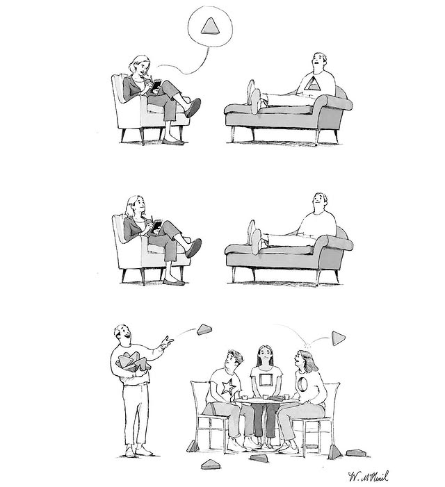

# Was Ist Das Für Eine Textwand?

Ich gehe offen mit meinem ADHS um, kenne meine dadurch entstandenen Schwächen und Stärken und schaffe es im Chaos meine Stabilität zu finden. Das war nicht immer so.
Meine Mutter hat lange versucht mich alternativ durch viele Sorten Therapie, Ernährungskonzepte und besondere Betreuung behandeln zu lassen weil sie mir keine Medikamente und auch das Stigma nicht zumuten wollte.
Ich will nicht sagen, dass mir das nichts gebracht hätte. Im Gegenteil. Ich profitiere noch heute davon. Aber das was es eigentlich lösen sollte, hat es nicht gelöst. Vielleicht gelindert.
Und dann kamen die Medis.
Weil ich für meinen Teil weiß wie viel Lebensqualität mir die Behandlung durch Medikamente gegeben hat und auch heute wieder gibt, bin ich immer wieder ein wenig traurig wenn mir Leute erzählen
> "Aber das ist doch auch überdiagnostiziert. Das hat doch jeder. Da muss man sich halt einfach mal am Riemen reißen. Man muss ja nicht gleich jeden mit Medikamenten ruhig stellen."

Ich sage nicht, dass Medis die einzige Lösung sind und alle die sich mit Yoga und Mikronährstoffen behandeln es falsch machen. ADHS ist ein riesiges Spektrum. Vielleicht reicht es ja schon. Vielleicht funktioniert es für jemanden. Doof nur wenn man sich vor den Möglichkeiten verschließt weil man meint das wäre alles böse und gefährlich.

Also schreib ich immer mal wieder hier weiter wenn mir mal wieder jemand eine Frage stellt oder Sorge mit mir teilt damit die Frage und meine Meinung, meine Erfahrungen und mein Halbwissen zu dem Thema auch anderen helfen.
Die Themen sind nicht wirklich nach Wichtigkeit oder Häufigkeit sortiert aber ich versuche sie so gut wie möglich zu gruppieren.

!!! info "Disclaimer"
    Dieser Inhalt ist nicht von einem Arzt oder einer Praxis herausgegeben und will auch gar nicht so tun als ob.
    Ich bin nur so'n Typ. Ich hab keine medizinische Ausbildung und ich schreibe aus dem Vorurteil heraus, dass die medizinische Behandlung Lebensqualität bringt und die Therapie die vorherigen vielen Traumata, die man ohne Behandlung erleiden musste, zu verarbeiten hilft.
    Meine Meinung, meine anekdotische Evidenz und meine mit meinem Vorurteil herausgesuchten Quellen ersetzen keine professionelle Beratung. Sie sind lediglich eine weitere Informationsquelle.

    Dies ist nur eine weitere Informationsquelle von einem Betroffenen für Betroffene, wie es bei einem lockeren Gespräch aufkommen könnte, in einer Sprache die einem ADHS-ler vielleicht auch sehr vertraut ist.
    Was für mich funktioniert, muss aber nicht für dich funktionieren. Du musst mir auch nicht zustimmen. Im Gegenteil. Schreib mir gerne wenn dir was auffällt oder mehr Fragen aufwirft.

# Zielgruppe

Von ADHS-ler für ADHS-ler.

Ich schreibe hier üblicherweise für Menschen die selbst betroffen sind. Entweder weil sie sich selbst diagnostiziert haben, weil sie eine Diagnose haben oder weil sie sich in einem Prozess befinden in dem sie sich mit dem Thema auseinandersetzen.

Ich schreibe daher oft in einer Art und Weise, die impliziert, dass mein Gegenüber auch betroffen ist.

# Mitmachen

Diese Website wird aus einem  [GitHub Repository](https://github.com/polite-raccoon/adhd-info-dump) heraus gehostet. Das bedeutet, dass du gerne mitmachen kannst.
Sei es, dass du Fehler findest, die du korrigieren möchtest, oder dass du Ergänzungen hast, die du gerne hinzufügen möchtest. Oder du hast eine ganz andere Meinung zu einem Thema und möchtest das gerne teilen.
Dann öffne einfach ein [Issue](https://github.com/polite-raccoon/adhd-info-dump/issues) oder [einen Pull Request](https://github.com/polite-raccoon/adhd-info-dump/pulls) und ich schau mir das an.
